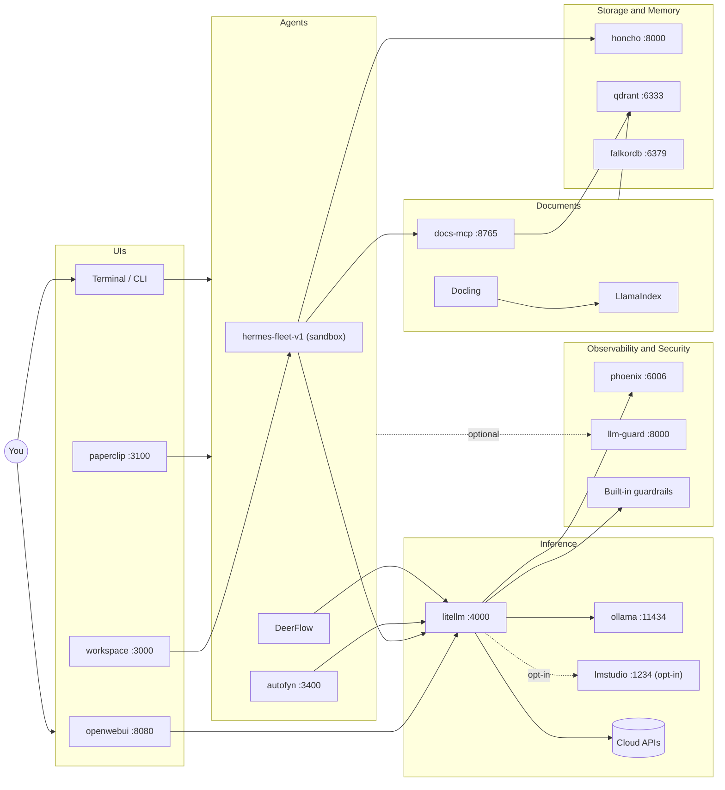
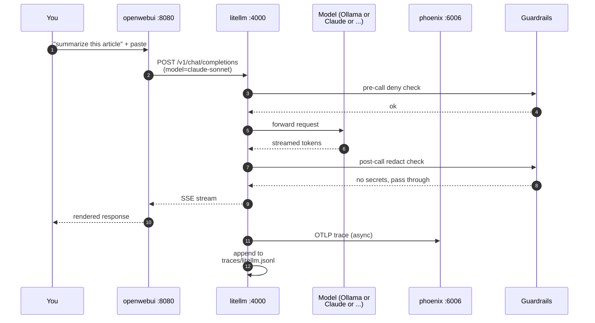
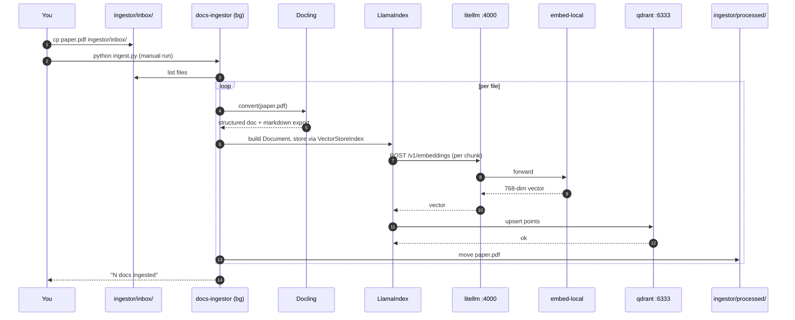
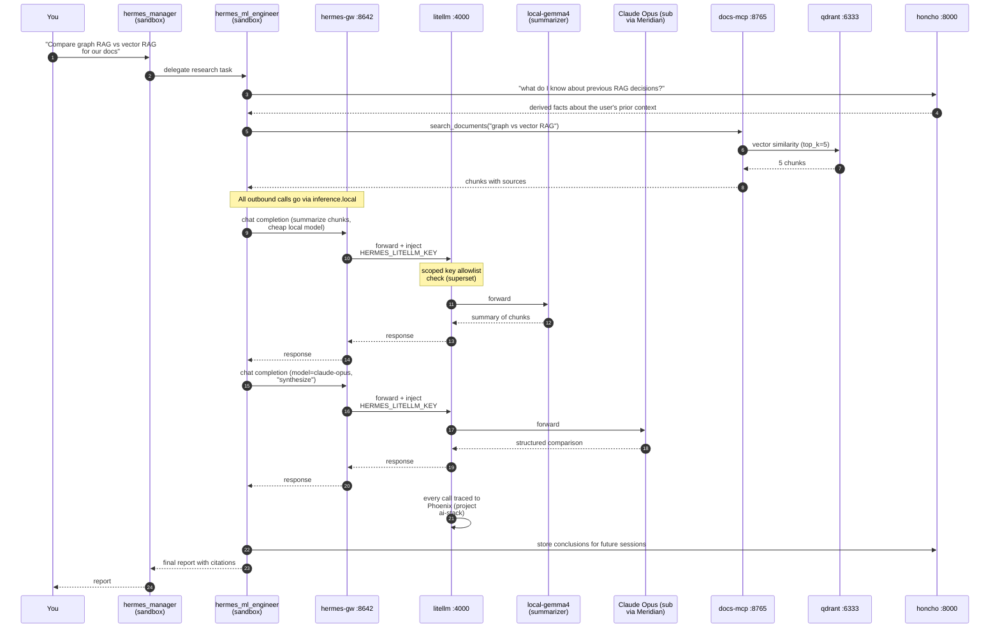

# vz-ai-stack

**Your own private AI cloud — 51 services, one Mac, zero bytes leaving the building.**

      

ai-stack turns one Apple Silicon Mac into a complete, self-hosted AI platform: local models, a fleet of agents, memory, RAG, and full call-by-call observability — all wired behind a single local endpoint. One installer brings up all 51 services, validates them end-to-end, and heals itself. Nothing phones home; cloud is opt-in only when you add your own keys.

---

## Why you want this

- **One local endpoint for everything** — point any app or agent at `http://litellm:4000/v1` and get model routing, scoped keys, and tracing for free.
- **Watch every thought your agents have** — every LLM call lands in Phoenix at `http://phoenix:6006`: prompts, responses, latency, and cost, all in one UI.
- **A whole team in a box** — the Hermes 9-role engineering fleet (manager, techlead, frontend/backend/ML engineers, QA, reviewer, SRE, incident manager), a sandboxed Pi coder, DeerFlow research workflows, and a ChatGPT-style chat UI at `http://openwebui:8080`.
- **Truly local-first** — models, memory, traces, and documents all stay on your machine; it works fully offline and only touches the cloud if you hand it keys.
- **Three local models, sensible defaults** — `gemma4` runs by default on Ollama; opt into heavyweight Qwen reasoning and coding models on LM Studio MLX when you want them.
- **One installer, self-healing and reversible** — brings up all 51 services, resumes if interrupted, never destroys a running container without confirmation, and proves itself with 68/71 doctor checks.
- **See it before you run it** — [`doc/EXPLORE.html`](doc/EXPLORE.html) is a single self-contained page (just double-click, works offline) with a searchable card and copy-paste demo for every service.

---

## 🗺️ See the whole platform in one file — [`doc/EXPLORE.html`](doc/EXPLORE.html)

The fastest way to grasp what this stack can do: open **[`doc/EXPLORE.html`](doc/EXPLORE.html)**
in any browser. It's a **single self-contained file** — no server, no build, no internet —
so you can just double-click it; it even works offline straight from `file://`.

> **AI-Stack Explorer** — *“All 51 installed services across 7 tiers · self-contained — works offline from file://”*

It renders an interactive, searchable card for **every** service — what it is, why you'd
reach for it, and a copy-paste demo — grouped into seven color-coded tiers:

| Tier | A few of what's inside |
|------|------------------------|
| **Try-me UIs (open in a browser)** | Open WebUI · Hermes Workspace · claw3d · Autofyn · Paperclip · Phoenix |
| **Agents you talk to** | Hermes 9-role eng team · Pi · OpenShell · Telegram gateway |
| **Research & reasoning agents** | DeerFlow · ACE · RLM · HALO · dual-LLM researcher |
| **Inference & data plane** | LiteLLM · Ollama · Qdrant · FalkorDB · Phoenix |
| **Memory, documents & code-intel** | Honcho · Lumen · docs-ingestor · docs-mcp |
| **Security & plumbing** | guardrails · llm-guard · SkillSpector |
| **Opt-in experimental extras** | portless · cmux · OpenAgents · LM Studio · Unsloth |

A **Start here** row puts the four things you can click immediately front and center —
**Open WebUI · Hermes Workspace · Phoenix · Autofyn** — each with a one-click launch link
and a copyable demo. As the page itself puts it:

> *“Search, filter by tier, hit Copy on any command, or **open ↗** to launch a UI. … Nothing here phones home.”*

```bash
open doc/EXPLORE.html      # macOS — opens it in your default browser
```

---

## How it fits together

You reach the stack through a UI or the terminal, and every AI request funnels through LiteLLM out to local or cloud models, with storage, document, and safety services hanging off to the side.



---

## What you get

A plain-language tour of the headline pieces (the full inventory is in the table below):

- **LiteLLM — the model hub.** One local endpoint (`http://litellm:4000/v1`) that
  every app and agent calls. It routes to your local models (and optionally to
  cloud providers if you add keys), enforces scoped keys, and emits traces automatically.
- **Phoenix — observability.** Every LLM call your agents make lands in the Phoenix
  UI (`http://phoenix:6006`) "for free" — see prompts, responses, latency, and cost
  in one place.
- **Hermes agent fleet — a 9-role software-engineering team.** Manager, tech lead,
  frontend, backend and ML engineers, a QA/test gate, a reviewing engineer (review +
  security), an SRE, and an incident manager — running a spec→deploy pipeline under a
  shared `team-protocol`, isolated inside an OpenShell sandbox. The same team is also
  realized as Pi personas (`bin/pi-as <role>`) and Claude Code agents — the manager as the main agent, the other 8 as subagents it dispatches. You can even
  chat with them from your phone via a Telegram bot. Review and edit every persona,
  skill and bootstrap file in one page with `vz-ai-stack.sh fleet-studio` (`doc/FLEET.html`).
- **Pi — sandboxed coding agent.** A coding agent locked in its own `pi-v1` sandbox
  with a tight egress allowlist — it can reach local models, memory, and your docs,
  but not Phoenix, Qdrant, the master key, or the open internet. Launch it with `bin/pi`.
- **DeerFlow — research workflows.** Multi-step agentic research runs that route through the
  same local model hub.
- **Open WebUI — chat in your browser.** A familiar ChatGPT-style UI wired to your
  local models, at `http://openwebui:8080`.
- **Three local models.** `local-gemma4` (Ollama `gemma4:e4b`, the always-on
  fallback every agent gates to when its runtime is down), `local-qwen3.6` (LM Studio MLX, heavy
  reasoning, opt-in), and `local-qwen3-coder` (LM Studio MLX, coding, opt-in). See [models.md](doc/models.md).

Plus storage (FalkorDB + Qdrant), cross-agent memory (Honcho), a docs RAG pipeline,
security guardrails, fine-tuning (Unsloth), and more — all in the table below.

---

## Novice quickstart — install

### Prerequisites

- **macOS** on Apple Silicon (tuned for an M-series, 24 GB box).
- **[OrbStack](https://orbstack.dev)** (the Docker runtime this stack uses) — or another
  Docker-compatible runtime. OrbStack is what Phase 00 expects.
- **[Homebrew](https://brew.sh)** — the installer uses `brew` to install host tooling
  (Ollama, `yq`, etc.).
- **Disk:** budget roughly **30–40 GB** for container images plus local model weights
  (the default `gemma4:e4b` alone is ~9.6 GB; the optional MLX models add ~17 GB each).

### The happy path

Run these in order, from the repo:

```bash
# 0. Go into the repo
cd ~/ai-stack

# 1. (Optional, recommended) Bootstrap host dependencies — runs as your normal
#    user, NO sudo. Verifies + installs + starts + re-verifies Homebrew, the core
#    CLI tools (yq jq node pnpm uv git tesseract openssl), OrbStack, and Ollama.
#    `deps --check` is a read-only CI gate. (Folded into install too, so skippable.)
bash vz-ai-stack.sh deps

# 2. (Optional, recommended) Enter API keys interactively — runs as your normal
#    user. EVERY key is skippable — a local-only or Claude-subscription (-sub, incl.
#    opus) setup needs NONE of them: local gemma + the subscription models work on
#    the generated baseline. (Skip this — ANY `install` (all or single-phase) makes
#    the .env baseline its first step and offers this on the first interactive run.)
bash vz-ai-stack.sh setup

# 3. The ONE sudo step (first time only).
#    Writes the /etc/hosts block, binds the 127.0.10.x loopback aliases to lo0,
#    installs a launchd plist so they persist across reboots, and flushes DNS.
#    Idempotent — safe to re-run.
sudo bash vz-ai-stack.sh prepare-sudo

# 4. Full install — runs as your normal user, NO sudo (it refuses to run under sudo).
#    Installs all core phases top-to-bottom; resumes if interrupted.
#    Preview first with `install all --dry-run` (alias --plan) — read-only, changes nothing.
bash vz-ai-stack.sh install all

# 5. Verify everything is healthy. Expect 68/68.
bash vz-ai-stack.sh doctor
```

> No cloud keys? You're done — `setup` (or the first-step baseline that every
> `install` now ensures) just generates the local secrets and you proceed. Cloud providers, GitHub, Blaxel and the Telegram
> bot are all opt-in and can be added later by re-running `setup`. Steps 1–2 (`deps`
> and `setup`) are optional-but-recommended and both run as your normal user; only
> `prepare-sudo` needs `sudo`.

> Tip: a cheap `bash vz-ai-stack.sh verify` (< 10 sec) probes the alias chain end-to-end
> and is worth running *before* the full install.

### Open the UIs

Once installed, reach services by their friendly alias (set up by `prepare-sudo` —
these resolve to `127.0.10.x`, not `localhost`):

- **Open WebUI (chat):** [http://openwebui:8080](http://openwebui:8080)
- **Phoenix (traces):** [http://phoenix:6006](http://phoenix:6006)
- **Hermes Workspace (fleet UI):** [http://workspace:3000](http://workspace:3000)
- **FalkorDB browser:** [http://falkordb-ui:3000](http://falkordb-ui:3000)
- **claw3d (3D agent office):** [http://localhost:4310](http://localhost:4310) (loopback-only by design)

The full alias → port table is in [PORTS.md](doc/PORTS.md).

---

## Use it — first things to try

Two flagship use-cases make the best on-ramp. Start with the 5-minute wow, then graduate to chatting with your own documents.

### The 5-Minute Wow: One Chat, Four Pillars Lit Up

*In a single chat round-trip you prove the whole stack is wired — proxy, local model, observability, and the host/container DNS — without writing a line of code.*

1. Open the chat UI at `http://openwebui:8080`.
2. Start a new chat, pick model **`local-gemma4`** (Gemma 4 E4B via Ollama, the default), and ask: *"What's the difference between LoRA and QLoRA?"*
3. Open the observability UI at `http://phoenix:6006` in another tab and watch the single trace appear: an Open WebUI → LiteLLM span, a LiteLLM → Ollama child span, plus token counts, latency (~3–8s on M4), and the model field `gemma4:e4b`.
4. That one trace proves the alias chain (`openwebui` → `litellm:4000` → `ollama:11434`), LiteLLM auth, and Phoenix's OTLP exporter are all working.

```bash
open http://openwebui:8080
open http://phoenix:6006
```

That round-trip looks like this — your message passes through LiteLLM and a quick safety check to a model, and the answer streams back while a trace is logged in the background:



### Chat With Your Own PDFs (RAG end-to-end)

*Drop a PDF on disk and ask questions about it in plain chat — Docling parses it, it gets embedded into Qdrant, and Open WebUI answers with citations to the exact chunks.*

1. Copy a PDF into the ingestor inbox folder.
2. Run the one-shot ingest sweep — it parses, chunks, embeds with `embed-local` (768-dim), and writes vectors into the `ai-stack-docs` Qdrant collection.
3. Confirm the vectors landed by checking the collection's `points_count`.
4. Start (or confirm) the docs-mcp server, then in Open WebUI add it as a tool (Settings → Tools → Add → `http://docs-mcp:8765`) and ask your docs a question.

```bash
cp ~/Downloads/some-paper.pdf ~/ai-stack/ingestor/inbox/
cd ~/ai-stack/ingestor && source .venv/bin/activate && python ingest.py
curl -s http://qdrant:6333/collections/ai-stack-docs | jq '.result.points_count'
bash ~/ai-stack/vz-ai-stack.sh start docs_mcp
curl -s http://docs-mcp:8765/health
```

The ingest sweep runs this pipeline — inbox → Docling → LlamaIndex → embeddings → Qdrant:



### Going deeper

Once the basics click, these scale up — full step-by-steps live in **[USER-GUIDE.md](doc/USER-GUIDE.md)**:

- **🔭 Watch a trace in Phoenix.** Tag any call (`-H 'x-trace-tag: my-exp'`) and find it instantly at [http://phoenix:6006](http://phoenix:6006) — prompt, latency, and cost, no guessing.
- **🤖 Dispatch a Hermes specialist in a sandbox.** `hermes hermes_backend_engineer "fix /sandbox/buggy.py …"` runs inside the deny-by-default `hermes-fleet-v1` — it can call models and write its workspace, but not touch the host or open internet.
- **🧰 Run the Pi coding agent.** `bin/pi` drops you into a tree-branching TUI coder locked to local models + your docs; from inside, hitting Phoenix returns `403 policy_denied`. Panic-stop with `bin/pi-kill`.
- **🔬 Kick off a DeerFlow research run.** `stack start deerflow` → open `http://localhost:2026` → ask a multi-step question; the fleet splits the work and every call is traced in Phoenix.

---

## Under the hood: a research agent end-to-end

A research agent recalls past context, searches your private docs, uses a cheap local model to summarize and a powerful cloud model to synthesize, then saves its conclusions for next time. The sandbox dispatch you ran above is one step of this flow.



---

## What's in the box

| Layer | Tool | Alias | Phase |
|---|---|---|---|
| Container runtime | OrbStack | — | 00 |
| Networking layer | `/etc/hosts` + `ai-stack` Docker bridge | — | 00·N |
| Inference proxy | LiteLLM | `litellm` | 01 |
| Local model serving | Ollama | `ollama` (host brew) | 01 |
| Observability | Phoenix (Arize) | `phoenix` + `phoenix-otlp` | 01·H |
| Graph DB | FalkorDB | `falkordb` + `falkordb-ui` | 02 |
| Vector DB | Qdrant | `qdrant` | 02 |
| Cross-agent memory | Honcho (self-hosted) | `honcho` | 03 |
| Agent sandbox | OpenShell | — | 04 |
| Agent fleet | Hermes — 9-role eng team | `hermes-gw` (reserved) | 04·F |
| Security | guardrails + LLM Guard + audit | `llm-guard` | 04·G |
| Chat UI | Open WebUI | `openwebui` | 05 |
| Fleet UI | Hermes Workspace | `workspace` | 05 |
| Docs RAG | Docling + LlamaIndex + MCP | `docs-mcp` | 06 |
| Coding agent | AutoFyn | `autofyn` | 07 |
| Task agent | Paperclip | `paperclip` | 08 |
| Research | DeerFlow | — | 10 |
| Cloud runtime | Blaxel (keys only) | — | 12 |
| Fine-tuning / training | Unsloth Studio | `unsloth` | 14 |
| Sandboxed coding agent | Pi (Earendil) | `pi-v1` (OpenShell sandbox) | 15 |
| Code semantic search (MCP) | Lumen (Ory) | `bin/lumen` (stdio, no port) | 16 |
| Verbatim Claude Code session memory (CLI + MCP) | MemPalace | `bin/mempalace` (CLI + stdio MCP, no port) | 26 |
| Recursive Language Models | RLM (`rlms`) | `bin/rlm` (Docker REPL sandbox) | 18 |
| 3D agent office | claw3d + stack-agents bridge | `claw3d` (`:4310`) | 19 |
| Fleet chat from your phone | Hermes Telegram gateway | `@vz_hermes_controller_bot` | 20 |

### Networking

Mac and containers reach services by name: `http://litellm:4000`, `http://phoenix:6006`,
`redis://falkordb:6379`, etc. The aliases are populated into `/etc/hosts`
(pointing at the `127.0.10.x` loopback range) and into Docker's embedded DNS
(via the `ai-stack` bridge network). Phase 00·N sets both up in one
idempotent pass. See [PORTS.md](doc/PORTS.md) for the full alias table.

---

## More commands

Beyond the [quickstart happy path](#novice-quickstart--install), the daily-driver
subcommands are:

```bash
# Bootstrap host deps / .env before installing (both no-sudo; see quickstart)
bash ~/ai-stack/vz-ai-stack.sh deps [--check]      # host-dependency bootstrap / CI gate
bash ~/ai-stack/vz-ai-stack.sh setup               # interactive .env / API-key bootstrap (alias: keys)

# Pick the Docker engine the WHOLE stack runs on (OrbStack default; also Docker
# Desktop / Colima / Podman). Pins AI_STACK_DOCKER_ENGINE → one DOCKER_HOST for
# every container + the OpenShell gateway. (Any command also takes `--engine <id>`.)
bash ~/ai-stack/vz-ai-stack.sh docker-engine select   # interactive picker (also: status | set <id> | context)
# Whether to also point your GLOBAL `docker context` at the stack engine is a saved
# preference (AI_STACK_DOCKER_CONTEXT: switch=default | keep), set in `setup` or via
# `docker-engine context <switch|keep>` — never an interactive prompt during install/doctor.

# Install/re-run one phase by NAME or number (run `phases` to list id→name)
bash ~/ai-stack/vz-ai-stack.sh install phoenix     # == install 01h
bash ~/ai-stack/vz-ai-stack.sh install all --dry-run  # read-only preview (alias --plan)
bash ~/ai-stack/vz-ai-stack.sh phases

# Manage embedding models per-service or globally (guards dim/coupling)
bash ~/ai-stack/vz-ai-stack.sh embedding list|show|assign <service> <model>|global <model>

# Focused per-command help (bare `help` / `--help` = full command list)
bash ~/ai-stack/vz-ai-stack.sh install --help      # == help install
bash ~/ai-stack/vz-ai-stack.sh help <service>      # per-service: what / config / usage

# See declared vs actual state
bash ~/ai-stack/vz-ai-stack.sh status

# Take ownership of a container started outside the installer
bash ~/ai-stack/vz-ai-stack.sh adopt <service>

# Apply queued restarts (e.g. after .env changes)
bash ~/ai-stack/vz-ai-stack.sh apply-restarts
```

Add this to your shell rc for the short `stack` alias:

```bash
export PATH="$HOME/ai-stack/bin:$PATH"
# Then:  stack status, stack doctor, stack adopt litellm, stack start/stop <svc>, etc.
```

---

## Where to read next

### Learn the stack (start here if it's all new)

- **[ONBOARDING.md](doc/ONBOARDING.md)** — *"you've installed the stack, here's how
  to actually use it."* The shortest path: `stack` basics (install by name or number,
  `phases`/`doctor`/`status`), reaching services by alias, the agents you can talk to
  (claw3d office, Telegram bot, Hermes/Pi/DeerFlow), the opt-in extras, the CPU guards
  (watchdog + OrbStack cap), and where logs/state live. **Read this first after install.**
- **[USER-GUIDE.md](doc/USER-GUIDE.md)** — task-oriented walkthrough for the
  first-time-in-this-stack reader. 5-minute wow → 4 core recipes (RAG,
  memory-aware coding, sandboxed Pi, Phoenix evals from JSONL replay) →
  3 stretch recipes (research fleet, paranoid mode, fine-tune) → daily
  cheatsheet → triage. Every recipe ends with the Phoenix trace pattern
  to look for. ~540 lines.
- **[STACK-GUIDE.md](doc/STACK-GUIDE.md)** — service-by-service tour. What every
  tool is, why it exists, what it does for you. Written for someone who
  knows what an LLM is but not what an "LLM proxy" or "vector DB" is. 20
  small Mermaid diagrams (every service box shows `name :port`). ~990 lines,
  but each service is ~200 words.
- **[CLAUDE-CODE-MODELS.md](doc/CLAUDE-CODE-MODELS.md)** — run the Claude Code CLI on
  **any** model this stack's LiteLLM serves (kimi, GLM, GPT, DeepSeek, your GPT-5
  ChatGPT-sub, Fugu, OpenRouter-Claude, or a local model) via `bin/claude-litellm` —
  full per-model compatibility matrix, RAM-safety, and key mint/budget/revoke.
- **[DIAGRAMS.md](doc/DIAGRAMS.md)** — system architecture in pictures. System
  overview, 8-layer boundary diagram, 4 user-story sequence diagrams (chat
  via Open WebUI, Hermes researcher uses local+cloud, PDF ingestion, agent
  runs a shell command in sandbox), security/trust boundaries, data
  locality ("what stays local vs goes to the cloud"), the 4 memory profiles.
- **[ALTERNATIVES.md](doc/ALTERNATIVES.md)** — for each tool, 3–5 substitutes
  with one-line differentiators. Useful if you're evaluating "should I use
  X instead of Y."

### Reference

- **[COMPONENTS.md](doc/COMPONENTS.md)** — brief catalog of everything in the stack:
  all 51 services + CLI tools, grouped by layer (inference, memory, agents, UIs,
  tools, platform), one line + access point each. The "what's in the box" index.
- **[ATTRIBUTION.md](doc/ATTRIBUTION.md)** — source link + license + ToS for every
  third-party tech piece (software *and* model weights), leading with the
  non-permissive ones to watch (OrbStack, Phoenix, FalkorDB, LFM2, …).
- **[PORTS.md](doc/PORTS.md)** — authoritative port + service map. Every port
  cross-referenced against `services.yml`, the start scripts, and live
  `docker inspect`. Conflict notes, reserved ports, and a single bash
  command to see what's actually listening right now.
- **[DEPENDENCIES.md](doc/DEPENDENCIES.md)** — dependency DAG, network topology
  (host vs container vs `honcho_default` network vs sandbox), talks-to
  matrix, 3 sequence diagrams for the most-important request flows,
  startup-order graph, and a failure-mode-cascade table for triage.
- **[models.md](doc/models.md)** — declarative model ↔ agent binding. `models.yml`
  as the single source of truth, the three local models, `vz-ai-stack.sh model
  {list,assign,sync,superset}`, availability-gating, and the scoped-key superset.

### Operate

- **First-time install** — read [INSTALL.md](doc/INSTALL.md). Step-by-step from a
  fresh machine, plus the post-install manual steps (Phoenix API key,
  foreign-container adoption, OpenShell sandbox).
- **Day-to-day** — read [OPERATIONS.md](doc/OPERATIONS.md). Daily commands, how to
  enable/disable services, common recipes.
- **Something's broken** — read [DOCTOR.md](doc/DOCTOR.md) for what each of the 68
  doctor checks means and how to fix, then [TROUBLESHOOTING.md](doc/TROUBLESHOOTING.md)
  for less common issues (incl. the OpenShell CPU-storm watchdog and the OrbStack CPU cap).

### Modify or extend

- **Becoming the owner** (a new agent or human taking over development) — read
  **[AGENT-ONBOARDING.md](doc/AGENT-ONBOARDING.md)** first. The owner's handoff: the
  mental model, the operating constitution + non-negotiables, the model/memory/fleet
  planes, the quirks that bite, the key decisions and *why*, and the file-by-file recipe
  for adding a feature — plus a copy-paste activation prompt that self-onboards a fresh agent.
- **Modifying the installer** — read [ARCHITECTURE.md](doc/ARCHITECTURE.md). Design
  decisions, file-by-file responsibilities, idempotency model, lock strategy,
  the multi-agent review cycle that produced the current shape.
- **Continuing this work** (next session, another Claude/human) — read
  [HANDOFF.md](doc/HANDOFF.md) first.
- **What changed and why** — read [CHANGELOG.md](CHANGELOG.md). The architecture
  decision and outcome of each non-trivial action are recorded there.

---

## Operating principles (Mayssam's constitution, internalized)

The installer follows these at every step. They override every other instinct:

1. **Do not assume; verify.** Every shell command was executed in a sandbox
   before being committed. Every config format is parsed back. Every env var
   is fetched from upstream docs, not pattern-matched from memory.
2. **Hypothesis-first.** Before changing code: state what's happening, why,
   what would prove or disprove it, smallest test to validate.
3. **Validate every step.** After any action, verify the intended effect.
4. **End-to-end success.** "Container started" ≠ done. "Exit 0" ≠ done.
   Done = works from your real perspective.
5. **Reversibility.** Backup before risky changes. Atomic writes for `.env`.
   `docker cp` before any container recreate that holds state.
6. **Fail loudly at preconditions.** Every script aborts at the top if
   required files / env vars / services are missing.

If you find yourself fighting the installer because it's being "too careful,"
that's the design — re-read [ARCHITECTURE.md](doc/ARCHITECTURE.md) before patching
the guard rails.

---

## Layout

```
~/ai-stack/
├── vz-ai-stack.sh              # entry point — bash-5+ gate + subcommand dispatcher
├── services.yml            # single source of truth (51 services, 4 profiles)
├── .env                    # secrets + config (0600)
├── README.md ← you are here
├── CHANGELOG.md            # what was decided + done
├── doc/                    # all docs: INSTALL, ARCHITECTURE, OPERATIONS, DOCTOR, TROUBLESHOOTING, HANDOFF, PORTS, …
├── CHANGELOG.d/            # per-run logs (avoid race on multi-shell)
├── bin/                    # daily-driver: stack, start-<svc>.sh, audit.sh
├── installer/
│   ├── lib/                # common, env, docker, validate, prompt, litellm, status, adopt, gc, history, reset, openshell
│   ├── phases/             # one file per phase (00 .. 30)
│   ├── doctor/checks/      # one file per failure mode (71 checks)
│   ├── smoke/              # per-phase end-to-end smoke tests
│   └── state/              # stamp files, restart queue, lock dir
├── litellm/                # config.yaml, trace_to_file.py, guardrails.py
├── data/                   # {phoenix,falkor,qdrant,honcho,openwebui}
├── traces/                 # litellm.jsonl + guardrails.jsonl
├── honcho/                 # cloned upstream + override
├── hermes-workspace/       # cloned upstream (Phase 05)
├── openshell/policies/     # network allowlists for sandboxes
└── ingestor/               # Phase 06: docs ingestion venv
    └── {inbox,processed}   # drop files here to ingest
```

---

## Status

See [CHANGELOG.md](CHANGELOG.md) and [doc/HANDOFF.md](doc/HANDOFF.md) for the full
snapshot; run `bash vz-ai-stack.sh doctor` for live state. Top-line:

- **29 core install phases (+17 opt-in extras: portless · cmux · skillspector · openagents · lmstudio · sourcegraph · aionui · openwork · understand · ingress · metagpt · agentscope · oasis · chatdev · aitown · concordia · slack) · 51 services · 71 doctor checks.**
- Phases install by **name or number** (`install phoenix` == `install 01h`); `vz-ai-stack.sh phases` lists id→name.
- A clean `reset --confirm hard --yes` → `install all` reaches **doctor green**
  (verified end-to-end 2026-05-31, incl. Phase 18 RLM, Phase 19 claw3d, Phase 20 Telegram);
  the 8 opt-in extras' checks (34–38, 49, 50, 51) pass-as-skip when not installed, check 39
  (`openshell_storm`) reports the watchdog status, and check 45 (`tutorial`, always-on)
  asserts `doc/TUTORIAL.html` and `doc/DIAGRAMS.html` are self-contained and in sync with their markdown sources.
- Each agent's LLM is now **declared per-agent** in `installer/models.yml` (single source
  of truth) and rendered by `vz-ai-stack.sh model {list,assign,sync,superset}`. Three local
  models: `local-gemma4` (Ollama gemma4:e4b — the always-on fallback agents gate to when their runtime is down),
  `local-qwen3.6` (LM Studio MLX, heavy reasoning), `local-qwen3-coder` (LM Studio MLX,
  coding). lmstudio-assigned agents auto-fall-back to `local-gemma4` when LM Studio (:1234)
  is down, so a plain `install all` works with no LM Studio. See [doc/models.md](doc/models.md).
  (`local-heavy` is a removed legacy Ollama alias — the heavy model now lives in
  LM Studio as `local-qwen3.6`. `local-lfm2` is likewise no longer auto-pulled.)
- Known-flaky: OpenShell's relay can idle-timeout (HANDOFF § 2.1) and surface 2
  sandbox-exec check failures (pi-v1, hermes) on a long-idle stack — a reset clears it.
  A separate failure (a sandbox's gateway token expiring ~8h → CPU storm) is caught by
  `bin/openshell-watchdog.sh` (launchd, every 600s): by default it's warn-only — halts
  the burn and raises an alert (doctor check 43); opt into auto-recreate with
  `AI_STACK_WATCHDOG_RECREATE=1`. See TROUBLESHOOTING.
