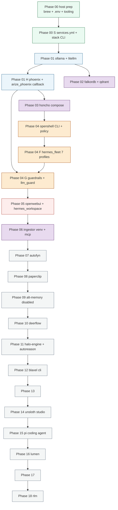

# DEPENDENCIES.md

Service-dependency, network-topology, talks-to, and startup-order reference for `~/ai-stack`. Cross-referenced against `services.yml`, `bin/start-*.sh`, `installer/phases/*.sh`, and live `docker inspect` (2026-05-28).

Sister doc: see [PORTS.md](PORTS.md) for the authoritative port map. Architecture rationale: [ARCHITECTURE.md](ARCHITECTURE.md).

> **URL form note** (2026-05-28). Mac-side and container-side URLs are now
> identical — `http://litellm:4000`, `http://phoenix:6006`,
> `http://openwebui:8080`. The previous port-free Mac URLs
> (`http://litellm`, etc.) no longer work because OrbStack collapsed every
> `--publish 127.0.10.X:80:Y` into a single `*:80` wildcard listener.
> See [CHANGELOG.md 2026-05-28 entry](../CHANGELOG.md).

---

## Dependency DAG

Edges are runtime dependencies. **Solid** = hard (downstream cannot do its job at all without upstream). **Dashed** = soft (downstream degrades gracefully — missing tracing, missing fallback, etc.).

```mermaid
graph TD
  classDef cloud fill:#fdf2e9,stroke:#a04000,color:#1c1c1c
  classDef brew fill:#eafaf1,stroke:#196f3d,color:#1c1c1c
  classDef docker fill:#ebf5fb,stroke:#1f618d,color:#1c1c1c
  classDef compose fill:#e8daef,stroke:#5b2c6f,color:#1c1c1c
  classDef cli fill:#f4f6f6,stroke:#5d6d7e,color:#1c1c1c

  anthropic[Anthropic API]:::cloud
  openai[OpenAI API]:::cloud
  openrouter[OpenRouter API]:::cloud
  google[Google Gemini API]:::cloud

  ollama[ollama :11434]:::brew
  litellm[litellm :4000]:::docker
  phoenix[phoenix :6006 + phoenix-otlp :4317]:::docker

  falkordb[falkordb :6379 + falkordb-ui :3000]:::docker
  qdrant[qdrant :6333]:::docker

  honcho_redis[honcho-redis-1 internal]:::compose
  honcho_db[honcho-database-1 internal]:::compose
  honcho_api[honcho :8000]:::compose
  honcho_deriver[honcho-deriver-1 internal]:::compose

  openwebui[openwebui :8080]:::docker
  hermes_workspace[workspace :3000]:::compose

  llm_guard[llm-guard :8000]:::docker

  openshell[hermes-fleet-v1 (sandbox)]:::cli
  hermes_fleet[hermes_fleet 7 profiles (sandbox)]:::cli

  docs_ingestor[docs-ingestor (bg)]:::cli
  docs_mcp[docs-mcp :8765]:::cli

  autofyn[autofyn :3400]:::compose
  paperclip[paperclip :3100]:::cli
  paperclip_honcho[paperclip_honcho_plugin]:::cli
  deerflow[deerflow]:::compose
  halo[halo (CLI)]:::cli

  %% --- hard edges (solid) ---
  litellm --> ollama
  honcho_api --> honcho_db
  honcho_api --> honcho_redis
  honcho_deriver --> honcho_api
  honcho_deriver --> honcho_db
  honcho_deriver --> honcho_redis
  honcho_api --> litellm
  honcho_deriver --> litellm
  openwebui --> litellm
  docs_ingestor --> qdrant
  docs_ingestor --> litellm
  docs_mcp --> qdrant
  docs_mcp --> litellm
  hermes_fleet --> openshell
  hermes_fleet --> litellm
  paperclip_honcho --> paperclip
  paperclip_honcho --> honcho_api

  %% --- cloud egress (hard, but optional per request) ---
  litellm -. on cloud-model call .-> anthropic
  litellm -. on cloud-model call .-> openai
  litellm -. on cloud-model call .-> openrouter
  litellm -. on cloud-model call .-> google

  %% --- soft edges (dashed) ---
  litellm -. arize_phoenix callback .-> phoenix
  halo -. routes via .-> litellm
  litellm -. guardrails callback .-> llm_guard
  hermes_fleet -. memory writes .-> honcho_api
  hermes_fleet -. doc retrieval .-> docs_mcp
  deerflow -. uses LLM .-> litellm
  autofyn -. uses LLM _unverified_ .-> litellm
```

**Reading the graph:**
- `litellm` is the keystone. Every chat-completion path crosses it.
- `phoenix` is a soft dep — LiteLLM keeps serving if Phoenix is down (the OTLP callback fails-soft; the call still completes).
- `halo` (the `halo-engine` CLI, exposing `bin/halo`) routes its own LLM calls through LiteLLM (local default); it does not read `traces/litellm.jsonl`.
- `falkordb` has no current callers in this stack (reserved for future graph-memory work).
- The cloud-provider edges are dotted because each call only uses one provider, chosen by `model:` in the request.

---

## Network topology

Three distinct planes meet at well-defined bridge points:

1. **macOS host** — Mac shell, browser, host-side Python (docs_ingestor, docs_mcp, halo, paperclip, rlm), and the brew-managed `ollama` service. Reaches `ai-stack` services by alias via the `/etc/hosts` block that Phase 00·N writes (`127.0.10.x` loopback range).
2. **`ai-stack` Docker bridge** (`10.99.0.0/24`) — every managed container joins via `--network ai-stack`. Docker's embedded DNS resolves bare container names to in-network IPs.
3. **`honcho_default` Docker network** — compose-internal for the Honcho stack. `honcho-api-1` and `honcho-deriver-1` are multi-network: they're on both `honcho_default` (to reach their database and redis) and `ai-stack` (to reach LiteLLM and to be reached by other services).
4. **OpenShell sandbox** (`hermes-fleet-v1`) — not joined to `ai-stack`; its egress is policy-controlled.

Inter-container traffic on `ai-stack` uses bare names. Containers on multiple networks use **fully-qualified DNS** (`<service>.<network>`) for cross-network calls — bare-name resolution order across networks is unspec'd.

```mermaid
graph LR
  subgraph HOST[macOS host - 127.0.10.x via /etc/hosts]
    direction TB
    ollama_h[ollama :11434]
    halo_h[halo (CLI)]
    docs_ingestor_h[docs-ingestor (bg)]
    docs_mcp_h[docs-mcp :8765]
    paperclip_h[paperclip :3100]
    user_h[user shell / browser]
    etc[/etc/hosts managed block/]
    traces_disk[(~/ai-stack/traces/litellm.jsonl)]
    data_disk[(~/ai-stack/data/*)]
  end

  subgraph AS[ai-stack bridge 10.99.0.0/24]
    direction TB
    litellm_c[litellm :4000]
    phoenix_c[phoenix :6006 + phoenix-otlp :4317]
    falkordb_c[falkordb :6379 + falkordb-ui :3000]
    qdrant_c[qdrant :6333]
    openwebui_c[openwebui :8080]
    llm_guard_c[llm-guard :8000]
    honcho_api_ext[honcho :8000 also here]
    honcho_deriver_ext[honcho-deriver also here]
  end

  subgraph HONCHO[honcho_default - compose internal]
    direction TB
    honcho_api_c[honcho-api]
    honcho_db_c[honcho-database]
    honcho_redis_c[honcho-redis]
    honcho_deriver_c[honcho-deriver]
  end

  subgraph SANDBOX[openshell sandbox hermes-fleet-v1]
    direction TB
    hermes_inside[hermes-fleet-v1 (sandbox)]
    sbx_gw[hermes-gw :8642]
  end

  user_h --> openwebui_c
  user_h --> phoenix_c
  user_h --> honcho_api_ext
  user_h --> ollama_h
  etc -. resolves 127.0.10.x .-> litellm_c

  openwebui_c -- "litellm:4000" --> litellm_c
  litellm_c -- "ollama:11434 host-gateway" --> ollama_h
  litellm_c -- "phoenix:6006" --> phoenix_c
  honcho_api_ext -- "litellm.ai-stack:4000 fully-qualified" --> litellm_c
  honcho_deriver_ext -- "litellm.ai-stack:4000 fully-qualified" --> litellm_c

  honcho_api_c <-- "database:5432" --> honcho_db_c
  honcho_api_c <-- "redis:6379" --> honcho_redis_c
  honcho_deriver_c <-- "api:8000" --> honcho_api_c
  honcho_deriver_c <-- "database:5432" --> honcho_db_c
  honcho_deriver_c <-- "redis:6379" --> honcho_redis_c
  honcho_api_c --- honcho_api_ext
  honcho_deriver_c --- honcho_deriver_ext

  hermes_inside -- "inference.local" --> sbx_gw
  sbx_gw -- "policy-allowed path to litellm:4000" --> litellm_c
  hermes_inside -. "honcho:8000 allowed" .-> honcho_api_ext
  hermes_inside -. "docs-mcp:8765 allowed" .-> docs_mcp_h

  docs_ingestor_h --> qdrant_c
  docs_ingestor_h --> litellm_c
  docs_mcp_h --> qdrant_c
  docs_mcp_h --> litellm_c

  litellm_c -. writes .-> traces_disk
  halo_h -. routes via .-> litellm_c
  litellm_c -. config + guardrails .-> data_disk
  honcho_db_c -. pgdata bind .-> data_disk
  phoenix_c -. mnt/data bind .-> data_disk
  falkordb_c -. RDB bind .-> data_disk
  qdrant_c -. storage bind .-> data_disk
  openwebui_c -. webui-state .-> data_disk
```

### OrbStack bind-mount notes

OrbStack on Apple Silicon uses an internal virtio-fs / 9P layer to bridge host paths into containers. Two operational facts captured in `installer/smoke/01.sh:39-46`:

- **Bind-mount direction is bidirectional** in steady state, but **the container holds an initial snapshot** at start time. Files the container writes do propagate to the host (e.g., `traces/litellm.jsonl` grows on both sides). But the smoke test demonstrates a quirk: the *host's* view of the trace file can lag the container's view until `docker rm -f` + recreate. The reliable read is from inside the container: `docker exec litellm sh -c 'wc -l < /traces/litellm.jsonl'`.
- **No anonymous volumes for stateful services.** Every stateful container mounts a path under `~/ai-stack/data/` so data survives `docker rm`. List of bind sources (host → container):
  - `~/ai-stack/litellm/` → `/app/config` (RW)
  - `~/ai-stack/traces/` → `/traces` (RW)
  - `~/ai-stack/guardrails/` → `/guardrails` (RO)
  - `~/ai-stack/data/phoenix/` → `/mnt/data`
  - `~/ai-stack/data/falkor/` → `/data`
  - `~/ai-stack/data/qdrant/` → `/qdrant/storage`
  - `~/ai-stack/data/honcho/` → `/var/lib/postgresql/data` (compose override)
  - `~/ai-stack/data/openwebui/` → `/app/backend/data`

### Network discipline

Inside the `ai-stack` Docker network, service-name aliases resolve via Docker's embedded DNS — `http://litellm:4000` from any joined container reaches the LiteLLM container. The single container-to-host path in the stack is to `ollama` (brew service), wired via `--add-host=ollama:host-gateway` on each consumer's `docker run` (LiteLLM today). Phase 00·N probes:

1. The `ai-stack` Docker network exists with driver `bridge`.
2. `/etc/hosts` carries every alias from `installer/lib/aliases.tsv` with the canonical `127.0.10.x` IP, sandwiched between the `# >>> ai-stack` markers.
3. Each alias is bound on `lo0` (`ifconfig lo0 alias 127.0.10.X up`) — required because macOS does NOT auto-route `127.0.0.0/8`. Persistence across reboot via `/Library/LaunchDaemons/com.ai-stack.loopback.plist`.
4. Each alias resolves via `dscacheutil -q host -a name <alias>` to its expected IP.
5. The Mac has no pre-existing 127.0.10.x routes that would redirect dials off-`lo0` (e.g., from a VPN profile).

The phase is idempotent — re-running on a healthy stack is a no-op, no `sudo` prompt fires unless the /etc/hosts block needs to change.

**Phase 00·V** runs immediately after 00·N and before any service starts. It re-probes the whole alias chain end-to-end (lo0 routability + dscacheutil/getent agreement + `--add-host=ollama:host-gateway` + `docker -p 127.0.10.X:Y:Z` + `curl`). If anything fails, Phase 01 never starts — see [INSTALL.md](INSTALL.md) and [DOCTOR.md § Check 19–22](DOCTOR.md).

---

## Talks-to matrix

Rows are callers, columns are callees. Cells are `endpoint | auth`. Empty cells mean no direct call. "n/a" means no authentication required.

URL forms below are now uniform across **vantage points**:
- **Mac side** (host shell / browser / host-side Python) — alias + native port (`http://litellm:4000`, `redis://falkordb:6379`).
- **Container side** on `ai-stack` — same form (`http://litellm:4000`, `http://phoenix:6006`). Docker's embedded DNS resolves bare names.
- **Multi-network containers** (honcho-api, honcho-deriver) — fully-qualified (`http://litellm.ai-stack:4000/v1`) to avoid Docker's unspec'd multi-network resolution order.
- **Sandbox side** — sandbox-internal name (`https://inference.local/v1`) for LiteLLM, or policy-allowed alias (`honcho:8000`, `docs-mcp:8765`).

| Caller \ Callee       | From  | ollama (host)             | litellm                                                         | phoenix                                       | honcho                                           | qdrant                     | docs-mcp                     | Cloud LLM providers                            |
|-----------------------|-------|---------------------------|-----------------------------------------------------------------|-----------------------------------------------|--------------------------------------------------|----------------------------|------------------------------|------------------------------------------------|
| `user` (browser/shell)| Mac   | `http://ollama:11434` / n/a | `http://litellm:4000/v1` / `Bearer LITELLM_MASTER_KEY`         | `http://phoenix:6006` / login UI              | `http://honcho:8000` / `HONCHO_API_KEY`          | `http://qdrant:6333` / n/a | `http://docs-mcp:8765` / n/a |  —                                              |
| `openwebui`           | ai-stack |                        | `http://litellm:4000/v1` / `Bearer LITELLM_MASTER_KEY`          |                                               |                                                  |                            |                              |                                                |
| `litellm`             | ai-stack | `http://ollama:11434` (host-gateway) / n/a |                                              | `http://phoenix:6006/v1/traces` / n/a (OTLP HTTP) |                                                  |                            |                              | HTTPS direct: Anthropic, OpenAI, Google; via API key in env |
| `honcho-api-1`        | multi-net |                        | `http://litellm.ai-stack:4000/v1` / `LITELLM_MASTER_KEY` (fully-qualified) |                                       | self (compose internal)                          |                            |                              |                                                |
| `honcho-deriver-1`    | multi-net |                        | `http://litellm.ai-stack:4000/v1` / `LITELLM_MASTER_KEY` (fully-qualified) |                                       | `http://api:8000` (compose net)                  |                            |                              |                                                |
| `docs_ingestor`       | Mac   |                           | `http://litellm:4000/v1` / `LITELLM_MASTER_KEY`                 |                                               |                                                  | `http://qdrant:6333` / n/a |                              |                                                |
| `docs_mcp`            | Mac   |                           | `http://litellm:4000/v1` / `LITELLM_MASTER_KEY`                 |                                               |                                                  | `http://qdrant:6333` / n/a | self                         |                                                |
| `hermes profile` (in sandbox) | sandbox |                  | `https://inference.local/v1` / `placeholder` (OpenShell L7 proxy enforces real auth) |                                | `http://honcho:8000` / `HONCHO_API_KEY` (policy-allowed) | | `http://docs-mcp:8765` / n/a (policy-allowed) |                                                |
| `bin/audit.sh`        | Mac   |                           | `http://litellm:4000/v1/chat/completions` / `Bearer LITELLM_MASTER_KEY` |                                            |                                                  |                            |                              |                                                |
| `halo` (`bin/halo`)   | Mac   |                           | `http://litellm:4000/v1` / `Bearer LITELLM_MASTER_KEY` (local default; cloud trace export disabled) |                                               |                                                  |                            |                              |                                                |
| `paperclip` / `paperclip_honcho_plugin` | Mac |             | _unverified_                                                    |                                               | `http://honcho:8000` / `HONCHO_API_KEY`          |                            |                              |                                                |
| `deerflow`            | ai-stack (if joined) |        | _unverified_ (likely `http://litellm:4000/v1`)                  |                                               |                                                  |                            |                              | _unverified_                                    |
| `autofyn`             | ai-stack |                        | _unverified_ (`http://litellm:4000/v1`)                         |                                               |                                                  |                            |                              | _unverified_                                    |
| `blaxel_cli`          | Mac   |                           |                                                                 |                                               |                                                  |                            |                              | HTTPS to `api.blaxel.ai` / `BLAXEL_API_KEY`     |
| `llm_guard`           | ai-stack |                        |                                                                 |                                               |                                                  |                            |                              | none (it's the callee; `Bearer LITELLM_MASTER_KEY` on `llm-guard:8000` / `http://llm-guard:8000` from Mac) |
| `unsloth` (studio)    | Mac (host:0.0.0.0) | `http://ollama:11434` (host-gateway) — used for inference after fine-tuned models are exported to GGUF | n/a (doesn't talk through LiteLLM)                              |                                               |                                                  |                            |                              | `https://huggingface.co` (model + dataset pulls), pypi (Python deps) |
| `pi` (sandboxed)      | openshell sandbox `pi-v1` | n/a (no direct ollama)        | `http://host.docker.internal:4000/v1` / `Bearer PI_LITELLM_KEY` (virtual key; allowlist=local-model superset [local, local-gemma4, local-heavy, local-lfm2, local-qwen3-coder, local-qwen3.6]; Pi's assigned model is local-qwen3-coder — see models.md) | n/a                                          | `http://host.docker.internal:8000` / `pi` peer namespace (soft isolation; Honcho v3 has no per-key peer enforcement) |                            | `http://host.docker.internal:8765` / n/a | n/a (policy denies)                              |
| `lumen` (Phase 16)    | Mac (stdio subprocess of each MCP client) | `http://localhost:11434` (default) — uses `ordis/jina-embeddings-v2-base-code` for embeddings | n/a (no LiteLLM dependency — Lumen is local-only) | n/a | n/a | n/a | n/a | n/a (no cloud egress)                            |

### Cloud-provider egress

| Provider     | Where used in config                                                  | Auth                                |
|--------------|-----------------------------------------------------------------------|-------------------------------------|
| Anthropic    | `claude-sonnet`, `claude-opus` model entries                          | `ANTHROPIC_API_KEY`                 |
| OpenAI       | `openai-gpt-*`, `embed-openai-small`, `embed-openai-large`            | `OPENAI_API_KEY`                    |
| OpenRouter   | All `openrouter-*` entries (10+ models)                               | `OPENROUTER_API_KEY`                |
| Google       | `google-gemini-3.1-pro`                                               | `GOOGLE_API_KEY`                    |
| Blaxel cloud | `bl` / `blaxel` CLI (deploys + execution; cloud-only, no local proxy) | `BLAXEL_API_KEY`, `BLAXEL_WORKSPACE` |

Provider rate-limit specifics are _not_ documented here — they vary per account tier and change frequently. LiteLLM's `fallbacks:` chain (in `litellm/config.yaml`) is the practical answer: when Anthropic 429s, requests for `claude-opus` re-route through `openrouter-claude-opus-4.7` → `openrouter-claude-opus-4.7-fast` → `openai-gpt-5.5-pro`.

---

## Sequence diagrams (3 key request flows)

### Flow A — chat completion through LiteLLM with trace export to Phoenix

```mermaid
sequenceDiagram
  autonumber
  participant U as User shell (curl)
  participant L as litellm :4000
  participant O as ollama :11434
  participant P as phoenix :6006
  participant T as traces/litellm.jsonl

  U->>L: POST http://litellm:4000/v1/chat/completions<br/>Authorization: Bearer LITELLM_MASTER_KEY<br/>model=local
  Note over L: master_key check;<br/>guardrails.handler pre-call scan
  L->>O: POST http://ollama:11434/api/chat (ollama_chat/gemma4:e4b)
  O-->>L: streaming tokens
  par fan-out callbacks
    L->>T: append JSON line (trace_to_file.handler)
  and
    L->>P: POST http://phoenix:6006/v1/traces<br/>OTLP HTTP span (arize_phoenix)
  end
  L-->>U: response body { choices: [...] }
  Note over P: span appears in Phoenix UI<br/>project: ai-stack
```

### Flow B — Hermes profile (in OpenShell sandbox) calling LiteLLM via `inference.local`

```mermaid
sequenceDiagram
  autonumber
  participant H as hermes profile (sandbox)
  participant G as hermes-gw :8642<br/>(inference.local)
  participant L as litellm :4000
  participant O as ollama :11434
  participant Mem as honcho :8000

  H->>G: POST https://inference.local/v1/chat/completions<br/>(api_base set in phase 04f bootstrap)
  Note over G: sandbox network policy: deny by default,<br/>inference.local is the only LiteLLM path
  G->>L: rewritten as litellm:4000 in ai-stack network
  Note over L: master_key validated by proxy;<br/>request-as-if-direct
  L->>O: ollama_chat/gemma4:e4b
  O-->>L: tokens
  L-->>G: response
  G-->>H: response
  opt memory-aware profile
    H->>Mem: POST http://honcho:8000/sessions/... (sandbox policy-allowed)
    Note over Mem: Honcho stores message;<br/>deriver picks up later for fact extraction
  end
```

### Flow C — Open WebUI sending a chat through LiteLLM + trace landing in Phoenix

```mermaid
sequenceDiagram
  autonumber
  participant Browser as User browser
  participant OW as openwebui :8080
  participant L as litellm :4000
  participant Cloud as Anthropic / OpenAI / Google
  participant P as phoenix :6006
  participant T as traces/litellm.jsonl

  Browser->>OW: HTTP POST /api/chat<br/>(user message; WEBUI_AUTH=False)
  OW->>L: POST http://litellm:4000/v1/chat/completions<br/>Authorization: Bearer $OPENAI_API_KEY<br/>(which is $LITELLM_MASTER_KEY)
  alt model=local
    L->>L: route to ollama (Flow A)
  else model=claude-opus etc.
    L->>Cloud: HTTPS to provider API
    Cloud-->>L: response
  end
  par
    L->>T: trace_to_file.handler appends JSON
  and
    L->>P: arize_phoenix OTLP HTTP span
  end
  L-->>OW: streaming chunks
  OW-->>Browser: SSE stream
  Note over P: span visible in UI within seconds<br/>(http://phoenix:6006)
```

---

## Startup-order diagram

The installer's phase order is also the runtime startup order. Each phase has a `precheck` so re-running is a no-op; the diagram shows logical ordering, not wall-clock duration.



**Hard ordering constraints** (cannot be reordered):
- `00 -> 00·S`: directory tree + `.env` must exist before services.yml validation.
- `00·S -> 01`: `bin/start-litellm.sh` reads `LITELLM_MASTER_KEY` set in phase 00.
- `01 -> 01·H`: phase 01·H mutates `litellm/config.yaml` to add `arize_phoenix` to callbacks; LiteLLM must already exist to need a callback added.
- `01 -> 03`: Honcho is configured to point `LLM_OPENAI_API_BASE` at LiteLLM; phase 03 also generates `HONCHO_API_KEY` and queues a LiteLLM restart.
- `01·H -> 04·G`: phase 04·G adds `guardrails.handler` to the same callbacks list — needs to come after the Phoenix callback so the `litellm_ensure_callback` helper has the up-to-date list.
- `04 -> 04·F`: sandbox `hermes-fleet-v1` must exist (created in 04) before the fleet bootstrap script can `openshell sandbox exec` into it.
- `01 -> any user`: nothing else can chat-complete until LiteLLM responds.

**Soft ordering** (phases 06–12 are technically independent of each other once 01–05 are up; the installer runs them in number order for predictability).

---

## Failure modes from dependency breaks

Triage table: when X is down, what visibly breaks.

| If X is down                  | Y breaks like this                                                                                                                              | Mitigation / detection                                                                                            |
|-------------------------------|-------------------------------------------------------------------------------------------------------------------------------------------------|-------------------------------------------------------------------------------------------------------------------|
| `ollama`                      | `model=local-gemma4` (the default) + embedding requests fail with connection refused on `ollama:11434`. The big MLX models (`local-qwen3.6`, `local-qwen3-coder`) live on LM Studio and are unaffected; cloud-model requests unaffected.                  | `brew services restart ollama` then `curl http://ollama:11434/api/tags`. LiteLLM has no `local` fallback by design (CHANGELOG cites this). |
| `litellm`                     | **Everything chat-related stops.** Open WebUI shows API errors; Honcho deriver background work pauses; Hermes profiles in sandbox can't think; docs_ingestor / docs_mcp can't embed; audit.sh fails. | `bash bin/start-litellm.sh` (or `install.sh apply-restarts`). Check `docker logs litellm` for ImportError on guardrails.py. |
| `phoenix`                     | LiteLLM still works. OTLP HTTP exports fail-soft (logged warnings, no spans visible in UI). `halo` still works (routes via LiteLLM).            | Phoenix is a soft dep. `bash bin/start-phoenix.sh`. Check `docker logs phoenix` for PHOENIX_SECRET policy errors.   |
| `qdrant`                      | `docs_ingestor` and `docs_mcp` fail on collection ops. Open WebUI's built-in RAG (if used with Qdrant) also breaks. Everything else unaffected. | `bash bin/start-qdrant.sh`, then `curl http://qdrant:6333/collections`.                                            |
| `falkordb`                    | Nothing in the active stack breaks (no current callers). Future graph-memory features would break. Doctor's collision check still passes if process is gone. | `bash bin/start-falkordb.sh`.                                                                                      |
| `honcho-api-1`                | Cross-agent memory writes / reads fail. Hermes profiles, paperclip_honcho_plugin lose memory. Honcho-unaware code paths unaffected.              | `cd honcho && docker compose up -d` or `bash bin/start-honcho.sh`. Check `curl http://honcho:8000/health`.         |
| `honcho-database-1` (pg)     | `honcho-api-1` becomes unhealthy (compose healthcheck `pg_isready` fails). `honcho-deriver-1` also stops processing. Open WebUI / LiteLLM unaffected. | Compose `depends_on` brings db up first; if it's failing, inspect `docker logs honcho-database-1` and `~/ai-stack/data/honcho/` permissions. |
| `honcho-redis-1`              | `honcho-api-1` healthcheck fails. Queue-backed work pauses. Same scope as db down.                                                              | `docker restart honcho-redis-1`. (No persisted state outside named volume `redis-data`.)                          |
| `honcho-deriver-1`            | API still serves; fact-extraction / summary derivation queues up but doesn't run. Memory still readable.                                        | `docker restart honcho-deriver-1`. Backlog drains automatically.                                                  |
| `openwebui`                   | Browser UI inaccessible at `http://openwebui:8080`. CLI / API / agent paths unaffected.                                                         | `bash bin/start-openwebui.sh`. State persists in `data/openwebui/`.                                                |
| `hermes_workspace`            | The Workspace UI is gone. Hermes profiles inside OpenShell sandbox still work via CLI.                                                          | `cd hermes-workspace && docker compose up -d`. Only present if clone succeeded.                                    |
| `llm_guard` (sidecar)         | If `guardrails.handler` is configured to call out to it, requests get warnings but still complete (LLM Guard is the *second-layer* scanner; the in-process callback is first-line). | `bash bin/start-llm_guard.sh`. Check `bin/audit.sh` check 4 for guardrails policy enforcement.                     |
| `openshell` sandbox missing   | `hermes_fleet` profiles unreachable. Phase 04·F skips sandbox-side actions (per `SKIP_SANDBOX_ACTIONS`); SOULs are staged on host.              | See `installer/state/openshell-manual-steps.md` — sandbox + gateway setup is hand-cranked.                         |
| `docs_mcp`                    | Hermes researcher's `search_documents` MCP calls fail. Direct Qdrant queries (e.g., `docs_ingestor`) still work.                                | `cd ingestor && source .venv/bin/activate && python mcp_server.py`. Binds `127.0.10.4:8765`.                       |
| `ai-stack` network or `/etc/hosts` broken | Every alias dial fails: `http://litellm:4000` from the Mac returns connection-refused, `http://litellm:4000` from a container returns "bad address." The host-gateway exception (`ollama:11434`) breaks independently — see the `ollama` row. | Phase 00·N + 00·V's doctor checks 14–22 detect this. Re-run `sudo bash install.sh prepare-sudo && bash install.sh verify`. If `dscacheutil` is stale, `sudo dscacheutil -flushcache; sudo killall -HUP mDNSResponder`. |
| `lo0` aliases not bound       | `/etc/hosts` resolves the alias correctly, but `curl http://litellm:4000` from the Mac hangs / connection-refused with no useful error. `dscacheutil -q host -a name litellm` returns the right IP — kernel has no path to it. | Doctor check 19 detects. Auto-fix: `sudo bash install.sh prepare-sudo` re-runs `lo0_ensure_aliases`. |
| `.env` corrupted (CRLF, malformed) | LiteLLM refuses to start (`load_env_strict` aborts in `start-litellm.sh`). Phoenix similar.                                                  | `install.sh doctor`. Check 03 (`installer/doctor/checks/03_env_valid.sh`) validates env shape.                     |
| Cloud API key revoked         | Requests to that provider's models return 401/403. LiteLLM's fallback chain may rescue (e.g., `claude-opus` falls back to `openrouter-claude-opus-4.7`). Eventually all fallbacks exhaust. | Inspect via Phoenix project `ai-stack` for the offending span; rotate key in `.env`; recreate LiteLLM.            |
| OrbStack daemon stopped       | Every `docker` command fails. Phase 00 detects this and tries to `open -a OrbStack` (60s timeout).                                              | `open -a OrbStack` manually; `docker info` to verify.                                                              |

### Restart-queue cascades

Some phases mutate `.env` or `config.yaml` and *queue* a restart of a downstream service rather than auto-restart it (conservative-mode):

- Phase 01·H adds `arize_phoenix` to LiteLLM callbacks → queues `litellm` restart.
- Phase 03 generates `HONCHO_API_KEY` → queues `litellm` restart (because litellm consumes that env via `consumes_env`).
- Phase 04·G adds `guardrails.handler` to LiteLLM callbacks → queues `litellm` restart.

User-visible: `install.sh` prints a `Queued restarts pending` banner. Apply with `bash install.sh apply-restarts`. Until then, the new callback / env value isn't active even though `services.yml` says it should be.

---

## Where to look next

- Per-port deep-dive: [PORTS.md](PORTS.md)
- Architecture rationale: [ARCHITECTURE.md](ARCHITECTURE.md)
- Daily-driver operations: [OPERATIONS.md](OPERATIONS.md)
- Diagnostics and self-healing: [DOCTOR.md](DOCTOR.md), [TROUBLESHOOTING.md](TROUBLESHOOTING.md)
