# Diagrams

System-level architecture diagrams for `~/ai-stack`. Mermaid renders
natively in GitHub and most editors.

> **Tip — if your editor's preview pane renders these too small to read** (text
> shrinks, boxes pack in, zoom only enlarges proportionally instead of
> letting you pan): open **[DIAGRAMS.html](DIAGRAMS.html)** instead. It's
> a single-file companion that renders the same diagrams via mermaid v11
> (much sharper than the older mermaid 9.x most preview tools embed),
> gives each diagram a per-card zoom + pan + full-screen button, and has
> a sticky table of contents on the left. Open it directly in any
> browser: `open ~/ai-stack/DIAGRAMS.html`.

This document is the visual companion to [STACK-GUIDE.md](STACK-GUIDE.md)
(what each service does) and [ALTERNATIVES.md](ALTERNATIVES.md) (what
else you could use). Read those for prose; read this for shape.

> **Footnote on labels.** Boxes use alias names (e.g., `litellm`,
> `phoenix`). All edges — Mac-side and container-to-container — use the
> alias plus native port: `http://litellm:4000`, `http://phoenix:6006`,
> `http://openwebui:8080`. Ollama is the one host-gateway exception —
> its port `:11434` is just its native listener port, same as the
> others. (The 2026-05-27 design originally dropped the port on
> Mac-side dials but the OrbStack `*:80` wildcard listener forced us to
> native ports; see [CHANGELOG.md 2026-05-28 entry](../CHANGELOG.md).)

---

## 1. System overview — what talks to what

The 10,000-foot view. Boxes are services, arrows are "calls" (not
necessarily bidirectional traffic — most return values flow back along
the same edge).

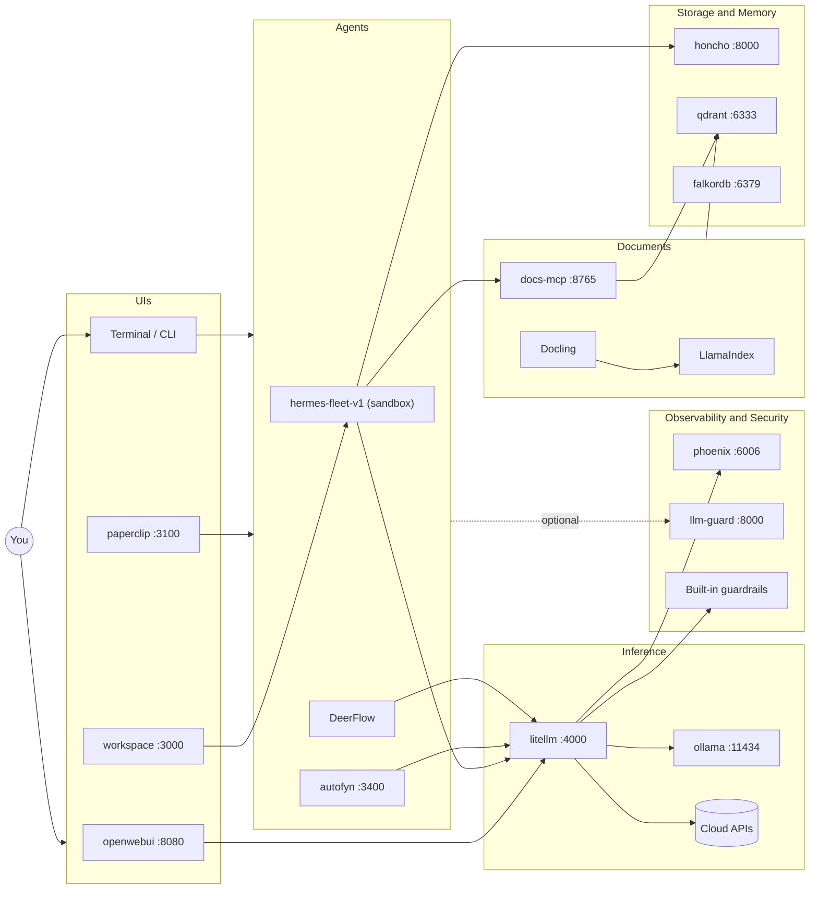

Key things to notice:
- Every LLM call funnels through LiteLLM.
- Phoenix only receives; it never sits in the request path.
- Honcho and Qdrant are the long-term state. Everything else is
  ephemeral.

---

## 2. Layer / boundary diagram

The same services grouped by responsibility. Useful when you want to
talk about, say, "the security layer" without listing four containers
by name.

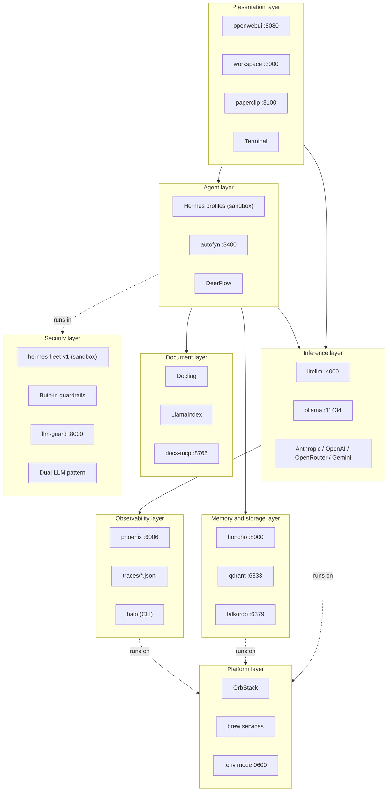

The boundary that matters most is **L7 wraps L2**. Every agent runs
inside the OpenShell sandbox; the rest of the stack does not.

---

## 3. User story: chatting with a model via Open WebUI

The simplest path through the stack. You type, you get an answer back.

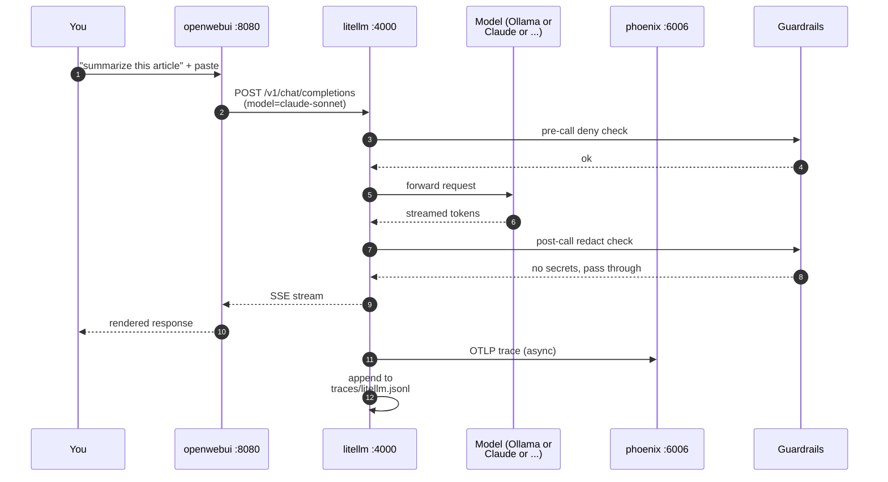

The guardrail checks are roughly 1 ms each — invisible to the user.
The trace ship to Phoenix is fully async; if Phoenix is down, the
response still arrives, you just lose the trace.

---

## 4. User story: Hermes researcher answers a question using local + cloud

The interesting path — combining local and cloud models, querying
internal docs, and running inside the OpenShell sandbox.

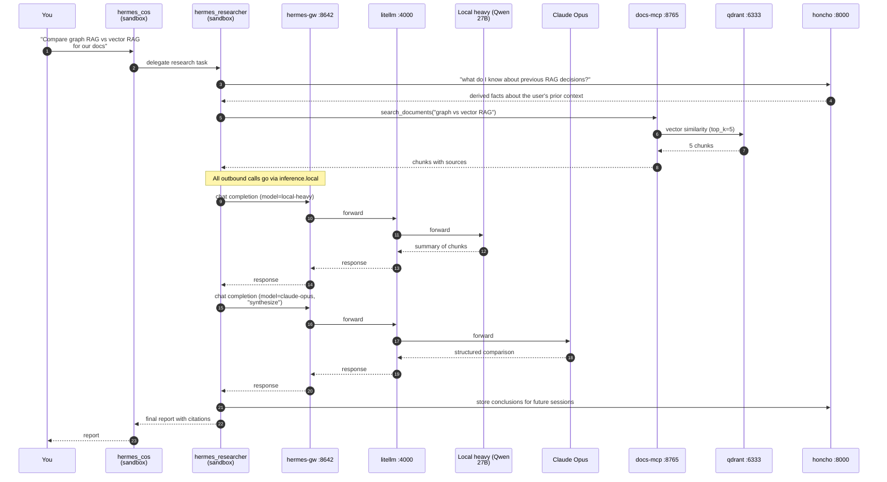

Three things this shows:
- The researcher uses **local-heavy** for cheap summarization and
  **claude-opus** for the high-stakes synthesis. Mixed cost discipline.
- Every external call goes via `inference.local`, the OpenShell L7
  proxy. The agent never sees a real API key.
- The researcher both reads and writes Honcho, so a follow-up question
  next week starts with the conclusions from today.

---

## 5. User story: ingesting a new PDF into RAG

You drop a file in `ingestor/inbox/`. Eventually agents can search it.

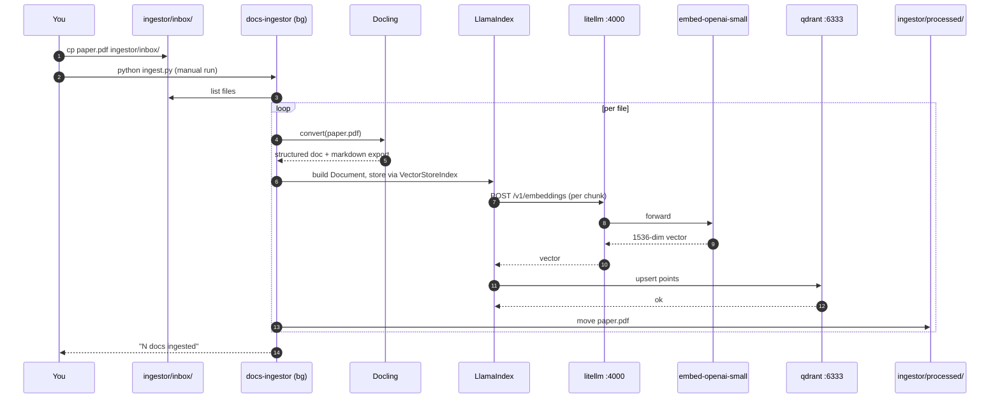

After this, `mcp_server.py` can serve `search_documents` queries
against the new chunks immediately — the MCP server opens the same
Qdrant collection.

---

## 6. User story: an agent runs a shell command (sandbox in action)

The path that justifies OpenShell's existence. The agent wants to `pip
install something`. We let it install from pypi but not write to
`~/.ssh/`.

This is the threat model. The agent does not need to be trustworthy
because the sandbox is not. Five distinct scenarios — one per diagram so
each stays legible.

**6.1 Allowed write inside the sandbox.**

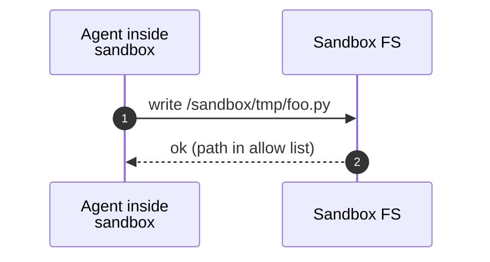

**6.2 Denied read of host secrets.** The agent asks for an SSH key; the
FS layer checks with the policy engine and refuses.

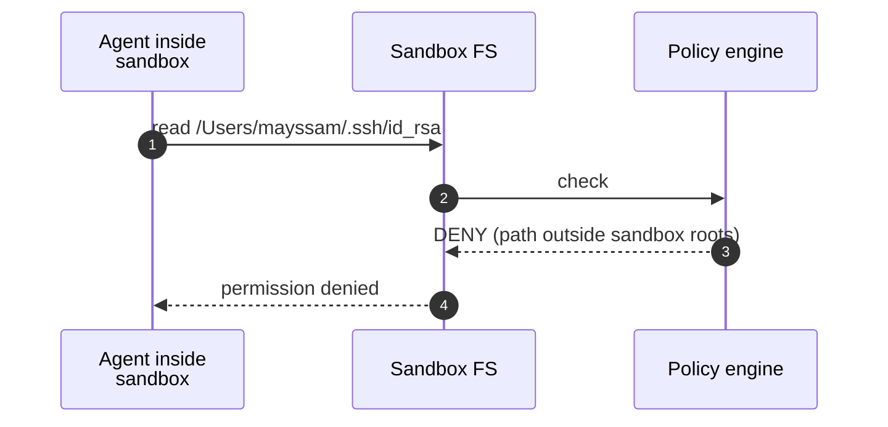

**6.3 Allowed network egress to an allowlisted host.** `pip install
requests` goes to pypi.org via the L4 firewall and L7 proxy.

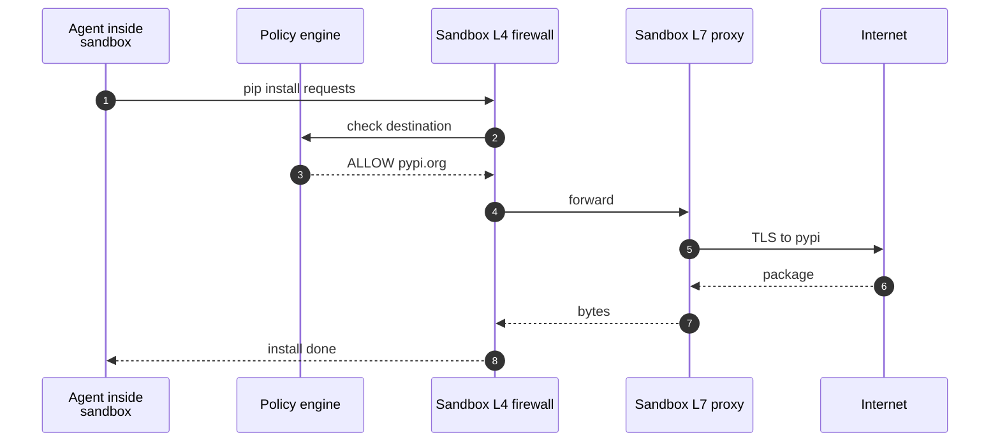

**6.4 Denied network egress to a non-allowlisted host.** The agent tries
to exfil to `attacker.com`; the L4 firewall rejects.

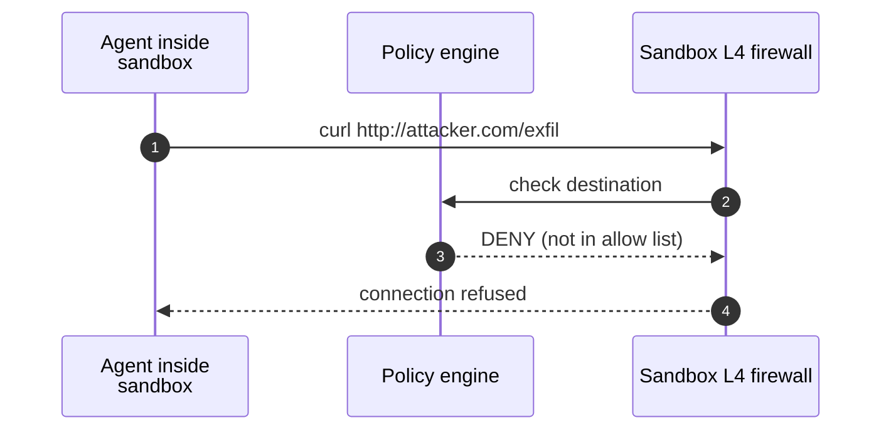

**6.5 Inference call through `inference.local`.** The agent dials the
sandbox-internal endpoint; the L7 proxy rewrites to `litellm:4000` on the
ai-stack network and injects the real bearer token server-side. The
agent never sees the master key.

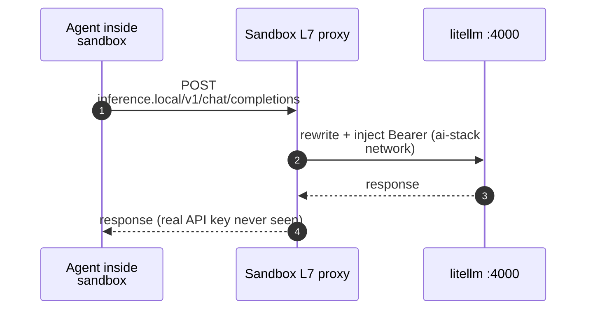

---

## 7. Security and sandbox boundaries

A different view of the same story — who can talk to whom, drawn as
trust boundaries instead of as a sequence.

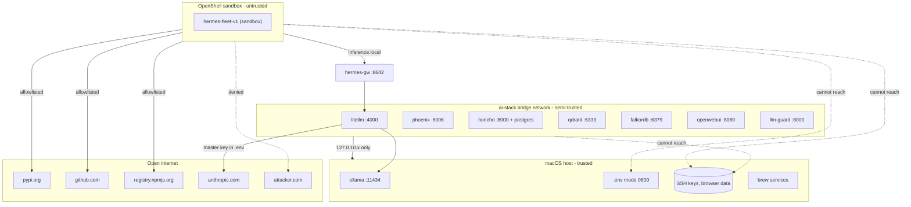

Trust tiers:
1. **Host** — full trust. Has your SSH keys, browser data, `.env`.
2. **Containers** — semi-trusted. Bound to `127.0.10.x` loopback only, so
   nothing on your network can reach them. They hold service state but no
   personal data. Inter-container traffic stays on the `ai-stack` bridge.
3. **Sandbox** — untrusted. Network deny-by-default. Filesystem locked
   to `/sandbox/` and `/tmp/`. API keys substituted by the L7 proxy.

The arrows that **don't exist** matter as much as the ones that do.

---

## 8. Where your data goes (privacy story)

The most important diagram for anyone deciding whether to use this
stack. Color and direction tell you what stays on your machine and what
leaves it.

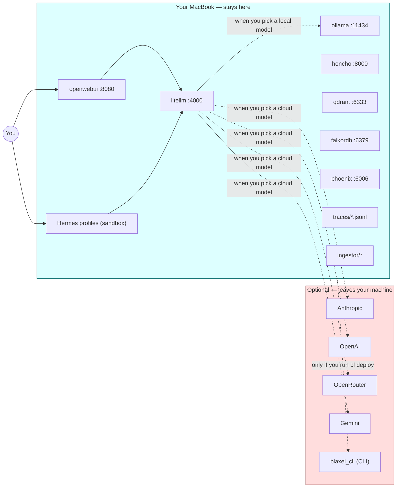

The rules:
- **Your prompts** only leave the machine if you pick a cloud model
  (anything not named `local` or `local-heavy`).
- **Your documents** never leave the machine. Docling parses locally;
  embeddings are computed via LiteLLM. If you pick `embed-local` (Ollama
  nomic-embed) instead of `embed-openai-small`, even the embeddings
  stay local.
- **Your memory (Honcho)** never leaves the machine. The derivations
  run via LiteLLM, so if Honcho calls a cloud model, the message
  content is sent to that model — but the derived facts stay in your
  Postgres.
- **Traces** are written to `traces/` on disk and into Phoenix's local
  SQLite. Neither sink is internet-connected.
- **Blaxel** is the only piece that is cloud-by-design. The CLI is
  installed but nothing deploys until you run `bl deploy`.

If you want fully air-gapped operation: use the `paranoid` profile
(`stack profile paranoid`), set every model to `local` / `local-heavy`,
disable cloud API keys in `.env`.

---

## 9. Per-call observability: where a trace lives

Every LiteLLM call produces traces in three places. This helps when
you want to figure out where to look for what.

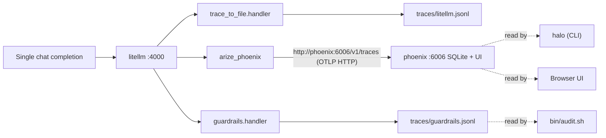

So:
- **What broke this morning?** → Phoenix UI.
- **Why did this prompt get blocked?** → grep `traces/guardrails.jsonl`.
- **What patterns are failing across 1000 runs?** → `halo` over the
  OTel traces in Phoenix (it reads OTel-format spans, not
  `traces/litellm.jsonl`).
- **Hot debugging right now?** → `tail -f traces/litellm.jsonl`.

---

## 10. Memory profiles — what runs in each mode

`stack profile <name>` flips a curated set of services on or off.
This diagram shows the four built-in profiles side by side.

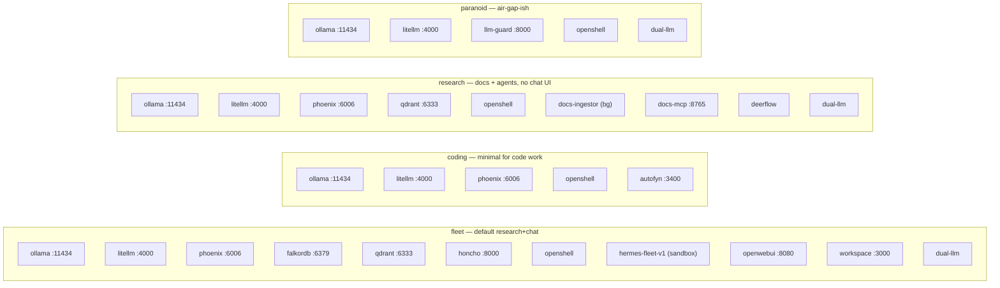

The profiles disagree only on the top tier. The inference plane
(LiteLLM + Ollama) is in every profile because nothing works without
it.

---

## 11. Network topology — host vs ai-stack vs OpenShell

Three distinct networks; the bridge points are where the interesting
traffic crosses.

```mermaid
flowchart TB
  subgraph Mac[macOS host - 127.0.10.x via /etc/hosts]
    direction TB
    Shell["Mac shell / browser"]
    OL[ollama :11434]
    DocsM[docs-mcp :8765]
    DocsI["docs-ingestor (bg)"]
    Etc[/etc/hosts managed block/]
  end

  subgraph AS[ai-stack docker bridge 10.99.0.0/24]
    direction TB
    LL[litellm :4000]
    PX[phoenix :6006]
    QD[qdrant :6333]
    FK[falkordb :6379]
    OWU[openwebui :8080]
    LG[llm-guard :8000]
    HA[honcho :8000]
    HD["honcho-deriver (internal)"]
  end

  subgraph HONCHO[honcho_default - compose internal]
    direction TB
    HA2[honcho-api also here]
    HDB[honcho-database]
    HRE[honcho-redis]
    HD2[honcho-deriver also here]
  end

  subgraph SBX[OpenShell sandbox - own egress policy]
    direction TB
    HF["hermes-fleet-v1 (sandbox)"]
    GW[hermes-gw :8642]
  end

  Shell -- dial alias via /etc/hosts --> LL
  Shell -- dial alias via /etc/hosts --> PX
  Shell -- dial alias via /etc/hosts --> QD
  Etc -. resolves 127.0.10.x .-> LL

  LL -- "ollama:11434 via host-gateway" --> OL
  LL -- "http://phoenix:6006 via docker DNS" --> PX
  HA -- "litellm.ai-stack:4000 fully-qualified" --> LL

  HA --- HA2
  HD --- HD2

  HF -- inference.local --> GW
  GW -- "policy-allowed, host-gateway path" --> LL
  HF -. "honcho:8000 allowed" .-> HA

  DocsM -- "http://litellm:4000 via /etc/hosts" --> LL
  DocsM -- "http://qdrant:6333 via /etc/hosts" --> QD
```

Reading it:
- **Bridge point #1**: `/etc/hosts` block on the Mac — gives the Mac
  shell, browser, and host-side Python processes name-resolution into
  the `127.0.10.x` range. Phase 00·N owns this.
- **Bridge point #2**: the `ai-stack` Docker network — every managed
  container joins it; Docker's embedded DNS handles intra-network bare
  names.
- **Bridge point #3**: `--add-host=ollama:host-gateway` on each Ollama
  consumer — the single allowed container-to-host alias. Port `:11434`
  stays in the URL.
- **Multi-network containers** (honcho-api, honcho-deriver) sit on both
  `ai-stack` and `honcho_default`. Cross-network calls use
  fully-qualified `<service>.<network>` to avoid bare-name ambiguity.
- **Sandbox does not join `ai-stack`.** Its egress is policy-controlled
  (deny by default); it reaches `litellm` only via the `hermes-gw` L7
  proxy.
