# Diagrams

System-level architecture diagrams for `~/ai-stack`. Mermaid renders
natively in GitHub and most editors.

> **Tip — if your editor's preview pane renders these too small to read** (text
> shrinks, boxes pack in, zoom only enlarges proportionally instead of
> letting you pan): open **[DIAGRAMS.html](DIAGRAMS.html)** instead. It's
> a single-file companion that renders the same diagrams via mermaid v11
> (much sharper than the older mermaid 9.x most preview tools embed),
> gives each diagram a per-card zoom + pan + full-screen button, and has
> a sticky table of contents on the left. Open it directly in any
> browser: `open ~/ai-stack/DIAGRAMS.html`.

This document is the visual companion to [STACK-GUIDE.md](STACK-GUIDE.md)
(what each service does) and [ALTERNATIVES.md](ALTERNATIVES.md) (what
else you could use). Read those for prose; read this for shape.

> **Footnote on labels.** Boxes use alias names (e.g., `litellm`,
> `phoenix`). All edges — Mac-side and container-to-container — use the
> alias plus native port: `http://litellm:4000`, `http://phoenix:6006`,
> `http://openwebui:8080`. Ollama is the one host-gateway exception —
> its port `:11434` is just its native listener port, same as the
> others. (The 2026-05-27 design originally dropped the port on
> Mac-side dials but the OrbStack `*:80` wildcard listener forced us to
> native ports; see [CHANGELOG.md 2026-05-28 entry](../CHANGELOG.md).)

---

## 1. System overview — what talks to what

The 10,000-foot view. Boxes are services, arrows are "calls" (not
necessarily bidirectional traffic — most return values flow back along
the same edge).

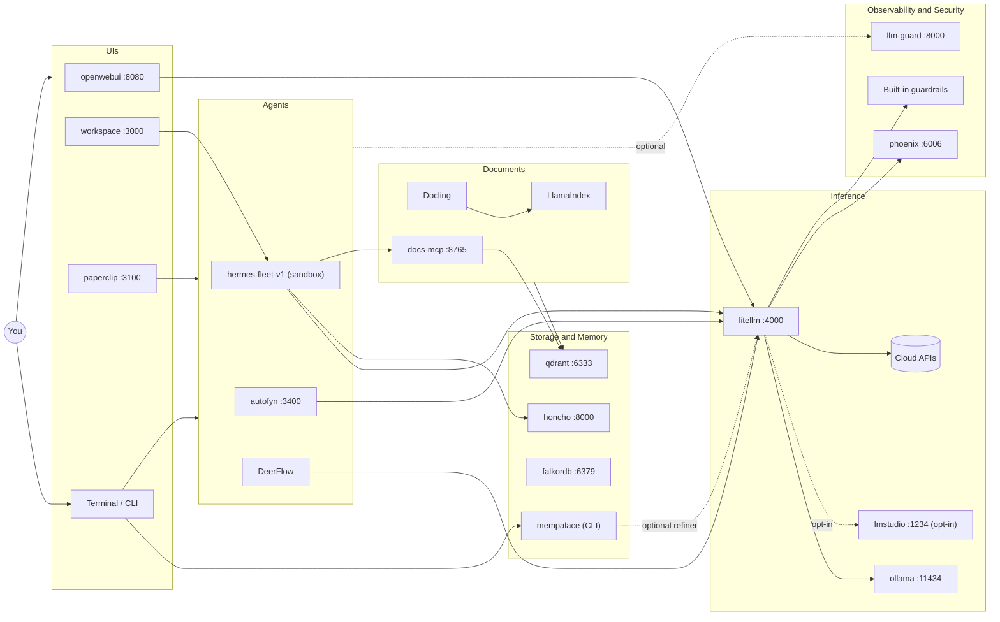

Key things to notice:
- Every LLM call funnels through LiteLLM. It fronts two local runtimes —
  Ollama (default, serves `local`) and, when you opt into Phase 25,
  LM Studio's MLX server (`:1234`, serves the heavy `local` /
  `local` MLX models) — plus the cloud APIs.
- Phoenix only receives; it never sits in the request path.
- Honcho and Qdrant are the long-term state. Everything else is
  ephemeral.
- MemPalace (Phase 26) is **CLI-only** verbatim conversation
  memory: its embeddings are computed **on-device** (local ONNX), so it
  touches LiteLLM *only* for the optional refiner LLM — and not at all
  otherwise.

---

## 2. Layer / boundary diagram

The same services grouped by responsibility. Useful when you want to
talk about, say, "the security layer" without listing four containers
by name.

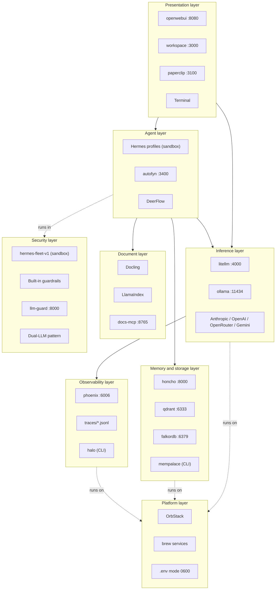

The boundary that matters most is **L7 wraps L2**. Every agent runs
inside the OpenShell sandbox; the rest of the stack does not.

---

## 3. User story: chatting with a model via Open WebUI

The simplest path through the stack. You type, you get an answer back.

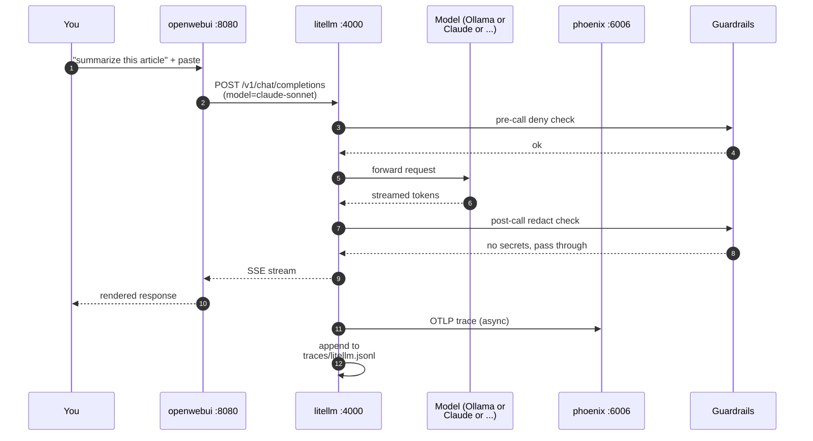

The guardrail checks are roughly 1 ms each — invisible to the user.
The trace ship to Phoenix is fully async; if Phoenix is down, the
response still arrives, you just lose the trace.

---

## 4. User story: Hermes researcher answers a question using local + cloud

The interesting path — combining local and cloud models, querying
internal docs, and running inside the OpenShell sandbox.

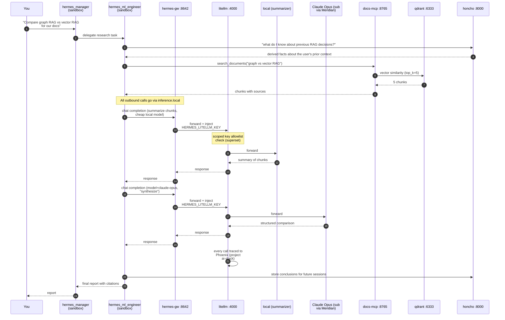

Three things this shows:
- The researcher (assigned **claude-opus-sub-max**, see [models.md](models.md)) uses a
  local model for cheap summarization and **claude-opus** for the high-stakes
  synthesis. Mixed cost discipline.
- Every external call goes via `inference.local`, the OpenShell L7
  proxy. The agent never sees a real API key — the proxy injects the
  fleet's scoped `HERMES_LITELLM_KEY`, and LiteLLM checks every model
  against that key's allowlist (the derived superset, so re-assigning
  a model never needs a key re-mint). Each call also lands in Phoenix
  project `ai-stack` for free.
- The researcher both reads and writes Honcho, so a follow-up question
  next week starts with the conclusions from today.

---

## 5. Model ↔ agent binding and availability-gating

How a per-agent model assignment becomes a live route. `models.yml` is
the canonical source of truth for the binding; `mayssam-ai-stack.sh model sync`
reconciles it into LiteLLM and re-renders each agent. The interesting
wrinkle is **availability-gating**: if an agent is assigned an
LM Studio (MLX) model but LiteLLM isn't currently serving it (LM Studio
is opt-in and may be off), the agent is rendered against the always-on
fallback `local` instead — never left pointing at a dead route.

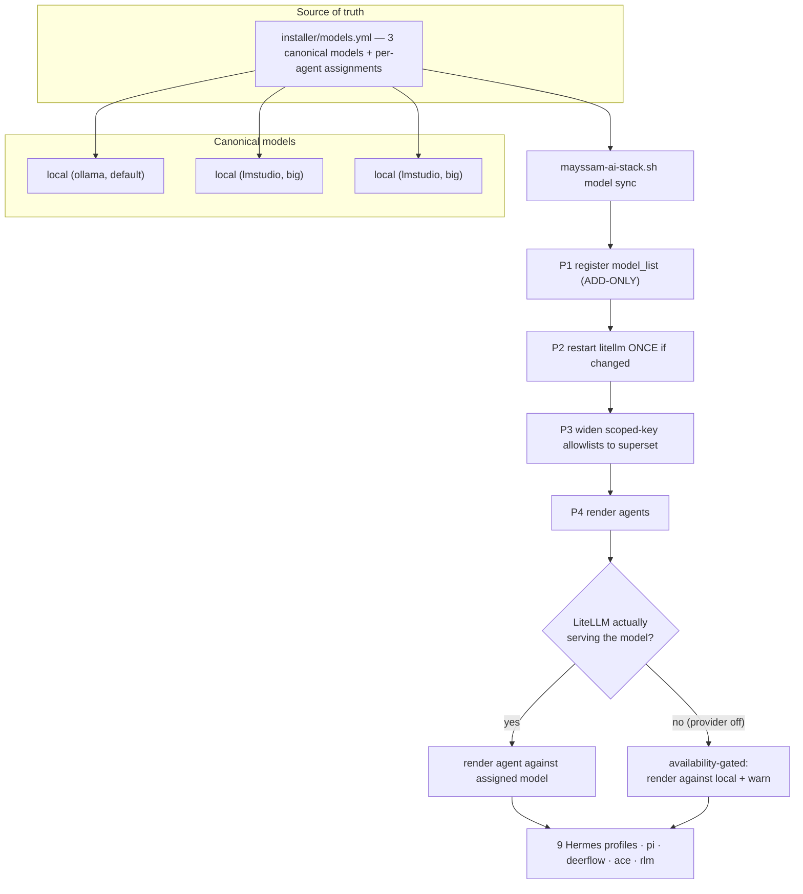

What the assignments look like (from `models.yml`, see
[models.md](models.md)):
- **claude-opus-sub-max** (subscription via Meridian; the platform default and
  `primary`) — every assigned role: `hermes_manager`, `hermes_techlead`, `hermes_ml_engineer`,
  `hermes_frontend_engineer`, `hermes_backend_engineer`,
  `hermes_qa_test_engineer`, `hermes_reviewing_engineer`, `hermes_sre_engineer`,
  `hermes_incident_manager`, `pi`, `deerflow`, `ace`, `rlm`.
- **sakana-fugu** — an available LiteLLM route, currently **unassigned** (no
  agent binds to it by default; `hermes_techlead` dropped it 2026-06-27 and is
  now on the `claude-opus-sub-max` default like every other role).
- **local** (the always-on Ollama fallback) — what every subscription- or
  LM-Studio-assigned agent (incl. all nine Hermes profiles) gates to when its runtime
  is down. An UNASSIGNED agent renders the `primary` (`claude-opus-sub-max`) and
  gates to this. (`default:` in models.yml names this fallback; it must be an Ollama model.)

Notes:
- The Hermes fleet now routes to a Claude subscription via the Meridian host
  daemon; availability-gating means when **Meridian is down** all nine profiles
  render against `local` (`nemotron-3-nano:4b`) and keep working. (`local` and
  `local-heavy` both map to nemotron — the ONLY local chat model; there is no
  heavy 27B local model any more.)
- `model sync` is opt-in and crash-safe; it is **not** run by
  `install all`. Phase 1 only ever adds to LiteLLM's `model_list`
  (ADD-ONLY), and LiteLLM is restarted at most once.
- Because every scoped key (`HERMES_LITELLM_KEY`, `PI_LITELLM_KEY`,
  `ACE_LITELLM_KEY`, `RLM_LITELLM_KEY`) is minted against the DERIVED
  `model superset` (`mayssam-ai-stack.sh model superset` — a sorted-unique union,
  not a hardcoded list), `model assign <agent> <model>` (or `model assign all
  <model>` for every agent) re-points agents without ever re-minting a key.
- The four diagrams below (§5a–§5e) zoom into this pipeline: §5a the
  per-agent selection (assignment → gate → effective → rendered + drift),
  §5b the multi-engine topology, §5c the discover/add/sync lifecycle, §5d
  the RAM-budget preflight, §5e Honcho agent memory.

---

## 5a. Per-agent model selection pipeline (assignment -> gate -> effective -> rendered)

Zooms into §5's per-agent step: the per-`kind` dispatch and the
rendered-vs-effective **drift** readback that §5 omits. `render_deerflow`
writes **two tiers** — `basic` is **always** `local`, `reasoning` is the
gated effective model — and uses the **master key**, so the P3 superset-widening
does not apply to it (and its basic tier does not "flip" to nemotron-3-nano:4b on gate-down,
it already *is* nemotron-3-nano:4b).

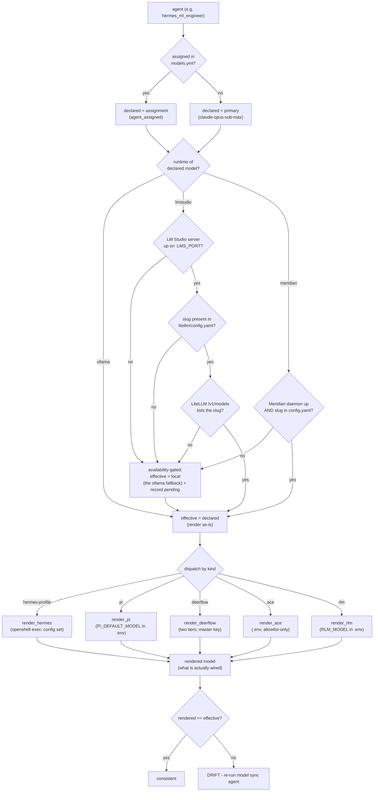

## 5b. Multi-engine inference topology — one hub, three runtimes

Provider keys live **only** in LiteLLM's env — no agent, sandbox, or scoped key
carries one. LM Studio's `api_base` is rendered with `${LMS_PORT}` (default
`1234`), never a bare literal.

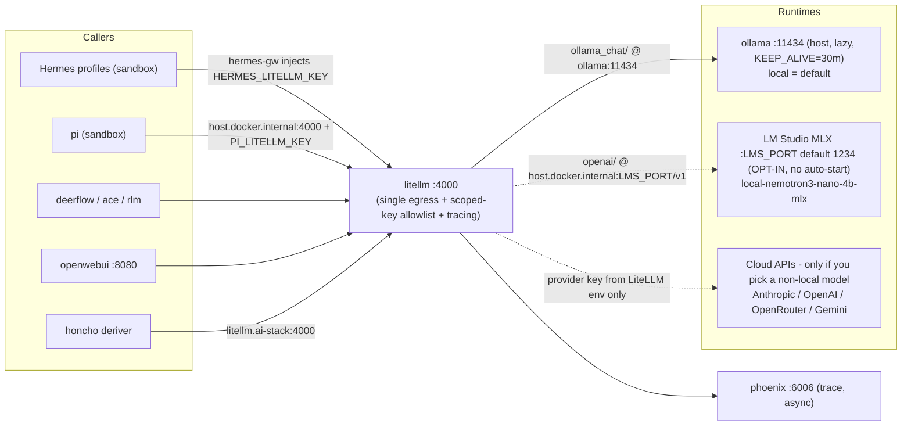

## 5c. Model discovery / add / sync lifecycle (LM Studio library -> models.yml -> LiteLLM)

Adds the READ-ONLY catalog → `models.yml` story §5 omits: `discover` and `add`
read the on-disk LM Studio library (server may be down) and **load nothing**;
only `sync` touches LiteLLM.

```mermaid
sequenceDiagram
  autonumber
  participant U as You
  participant M as mayssam-ai-stack.sh model
  participant LMS as LM Studio library (lms ls --json)
  participant YML as installer/models.yml
  participant CFG as litellm/config.yaml
  participant LL as litellm :4000

  U->>M: model discover
  M->>LMS: read on-disk catalog (READ-ONLY, server may be down)
  LMS-->>M: LLMs + embeddings + sizes
  M-->>U: table, marks DECLARED (exact served-id match) - loads nothing

  U->>M: model add <slug> [as local-name]
  M->>LMS: verify slug exists + read sizeBytes
  M->>YML: declare runtime=lmstudio, served, big (size>=MODEL_BIG_GB), ttl=1800
  Note over M: never loads the model

  M->>M: model sync (P0 validate)
  M->>CFG: P1 register model_list (ADD-ONLY, atomic)
  M->>LL: P2 restart ONCE iff config.yaml changed
  M->>LL: P3 widen scoped keys to the DERIVED superset
  M->>M: P4 render agents (availability-gated)
  M->>LL: P5 verify (drift + key coverage; advisory)
  M-->>U: synced - slug servable once LM Studio loads it
```

## 5d. RAM-budget preflight — the overkill guard that refuses an over-commit

Constants (see `installer/lib/lmstudio.sh`): headroom **5 GiB**
(`5368709120` B), unknown-size fallback **18 GiB** (`19327352832` B), resident
pad **+15%**. Refuses with the **strict** `> total` (equality loads); degrades
**OPEN** on any measurement failure.

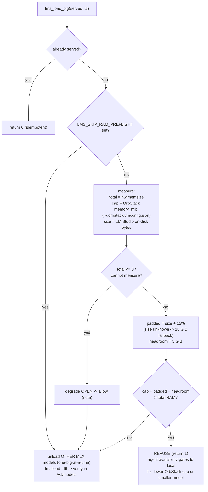

## 5e. Honcho agent memory — derivation via LiteLLM (not to be confused with §11 Memory profiles)

Not to be confused with [§11 Memory profiles](#11-memory-profiles--what-runs-in-each-ram-mode)
(RAM modes). All Honcho LLM roles (deriver, dialectic, summary, dream) use
`claude-opus-sub-xhigh` — Honcho's own default (`HONCHO_MODEL`, set in Phase 03),
not the stack-wide `primary` which is `claude-opus-sub-max` (Claude subscription
via Meridian; if Meridian is down LiteLLM now surfaces a visible 503 rather than
silently falling back).

```mermaid
sequenceDiagram
  autonumber
  participant AG as Agent (peer namespace)
  participant HO as honcho :8000 (api)
  participant DR as honcho deriver
  participant LL as litellm.ai-stack:4000
  participant LH as local (Ollama nemotron-3-nano:4b, default)
  participant PG as Postgres (data/honcho)

  AG->>HO: write message (session, peer-scoped)
  HO->>PG: persist raw message
  HO->>DR: enqueue derivation
  DR->>LL: extract user representation (model=claude-opus-sub-xhigh, override via HONCHO_MODEL)
  LL->>LH: forward
  Note over LL,LH: default is auto-pulled (nemotron-3-nano:4b); local + local-heavy both map to it (the only local chat model) — no heavy 27B model any more
  LH-->>LL: derived facts
  LL-->>DR: derived facts (also traced to Phoenix)
  DR->>PG: persist derived representation (namespace-isolated)
  AG->>HO: later - query peer memory
  HO->>PG: read peer-scoped facts
  PG-->>HO: facts
  HO-->>AG: context (never leaves the machine)
```

---

## 6. User story: ingesting a new PDF into RAG

You drop a file in `ingestor/inbox/`. Eventually agents can search it.

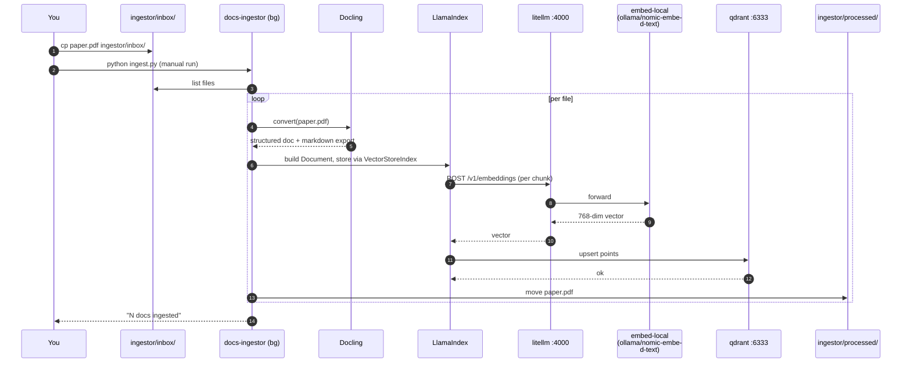

After this, `mcp_server.py` can serve `search_documents` queries
against the new chunks immediately — the MCP server opens the same
Qdrant collection.

---

## 7. User story: an agent runs a shell command (sandbox in action)

The path that justifies OpenShell's existence. The agent wants to `pip
install something`. We let it install from pypi but not write to
`~/.ssh/`.

This is the threat model. The agent does not need to be trustworthy
because the sandbox is not. Five distinct scenarios — one per diagram so
each stays legible.

**7.1 Allowed write inside the sandbox.**

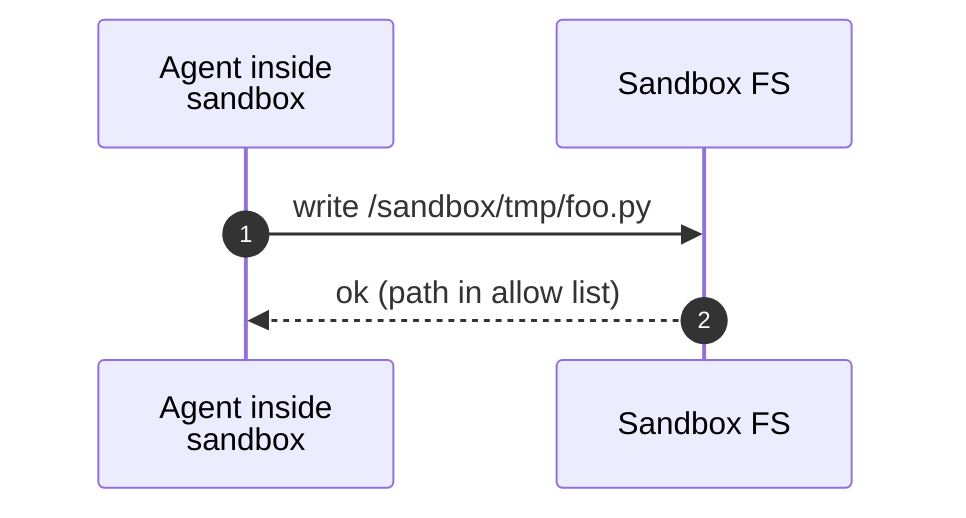

**7.2 Denied read of host secrets.** The agent asks for an SSH key; the
FS layer checks with the policy engine and refuses.

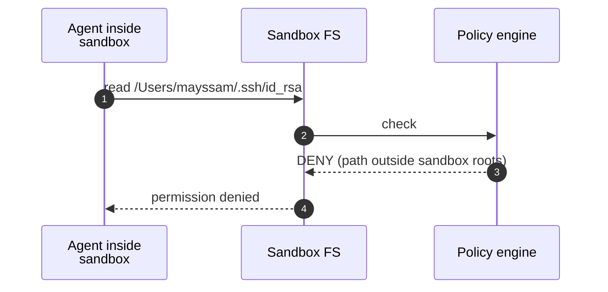

**7.3 Allowed network egress to an allowlisted host.** `pip install
requests` goes to pypi.org via the L4 firewall and L7 proxy.

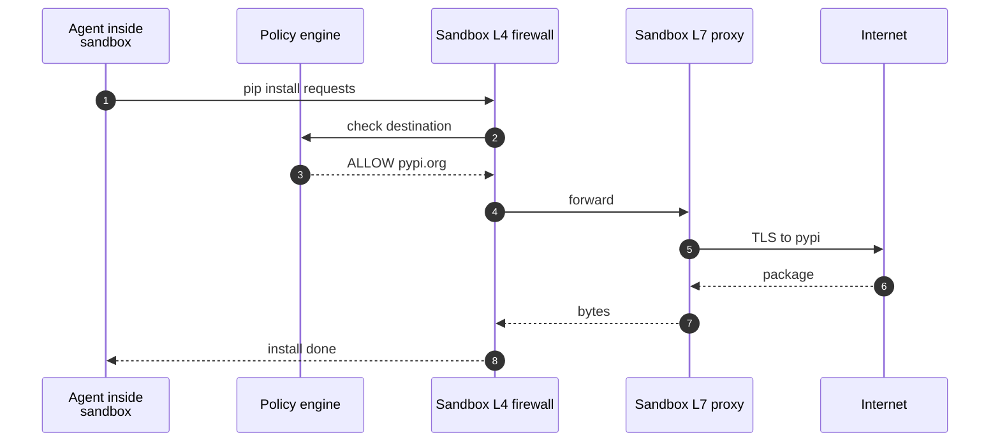

**7.4 Denied network egress to a non-allowlisted host.** The agent tries
to exfil to `attacker.com`; the L4 firewall rejects.

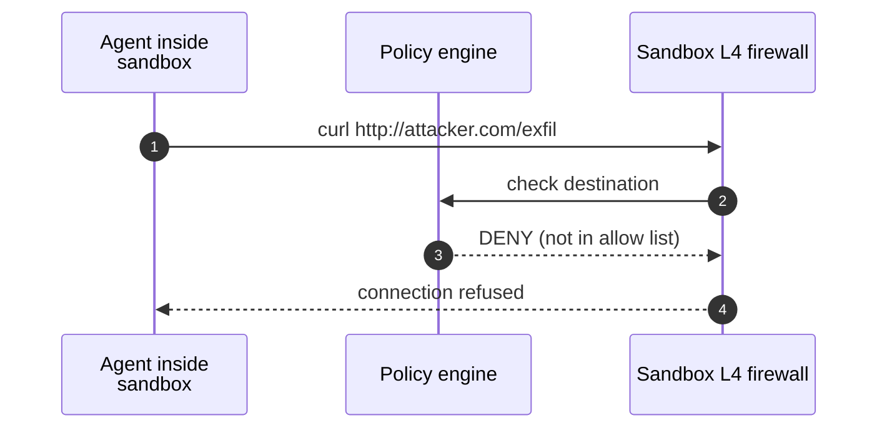

**7.5 Inference call through `inference.local`.** The agent dials the
sandbox-internal endpoint; the L7 proxy rewrites to `litellm:4000` on the
ai-stack network and injects the real bearer token server-side. The
agent never sees the master key.

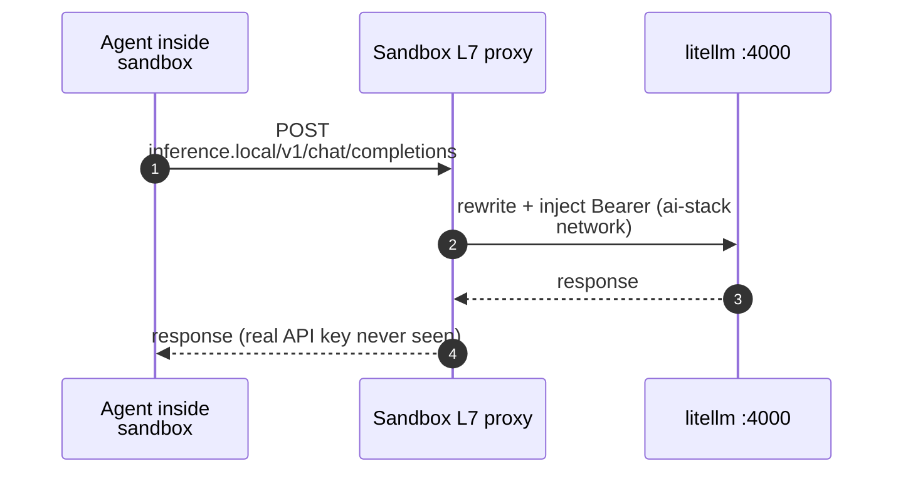

---

## 8. Security and sandbox boundaries

A different view of the same story — who can talk to whom, drawn as
trust boundaries instead of as a sequence.

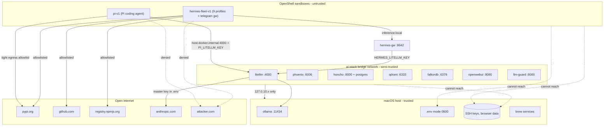

Trust tiers:
1. **Host** — full trust. Has your SSH keys, browser data, `.env`.
2. **Containers** — semi-trusted. Bound to `127.0.10.x` loopback only, so
   nothing on your network can reach them. They hold service state but no
   personal data. Inter-container traffic stays on the `ai-stack` bridge.
3. **Sandboxes** — untrusted. There are two: `hermes-fleet-v1` (the
   9-role Hermes fleet plus the Telegram gateway) and `pi-v1` (the Pi
   coding agent). Both are network deny-by-default with a tight egress
   allowlist; filesystem locked to `/sandbox/` and `/tmp/`. The fleet
   reaches LiteLLM through the `hermes-gw` L7 proxy (which injects
   `HERMES_LITELLM_KEY`); Pi dials `host.docker.internal:4000` with its
   own minted `PI_LITELLM_KEY`. Neither agent ever sees a real provider
   key.

The arrows that **don't exist** matter as much as the ones that do.

---

## 9. Where your data goes (privacy story)

The most important diagram for anyone deciding whether to use this
stack. Color and direction tell you what stays on your machine and what
leaves it.

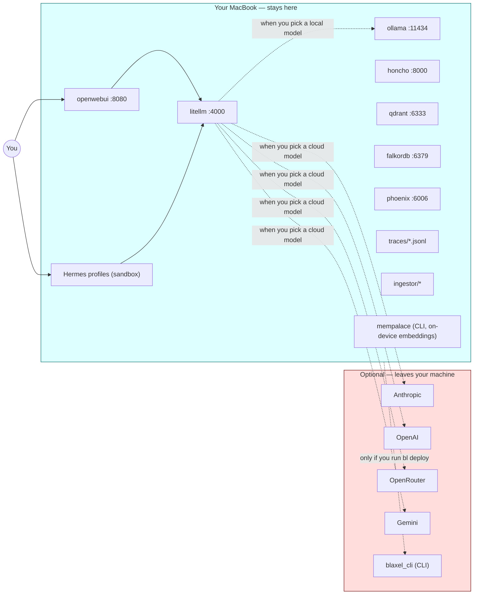

The rules:
- **Your prompts** only leave the machine if you pick a cloud model
  (anything not a `local-*` model).
- **Your documents** never leave the machine. Docling parses locally;
  embeddings are computed via LiteLLM. The default `embed-local` (Ollama
  nomic-embed, 768-dim) keeps even the embeddings on-box; the canonical
  cloud alternative is `embed-openai-small-768` (768-dim — the
  schema-compatible drop-in), and picking it sends your document text to
  OpenAI. Both sit at the canonical 768 dim, so switching costs only a
  re-index — but a family swap still means re-embedding everything.
- **Your memory (Honcho)** never leaves the machine. The derivations
  run via LiteLLM, so if Honcho calls a cloud model, the message
  content is sent to that model — but the derived facts stay in your
  Postgres.
- **MemPalace** (Phase 26) verbatim conversation memory is
  local-by-design: its embeddings are computed **on-device** (local
  ONNX), and its store (local ChromaDB) never leaves the machine. The
  only thing that can leave is the *optional* refiner LLM — and only via
  LiteLLM, only if you enable it and point it at a cloud model.
- **Traces** are written to `traces/` on disk and into Phoenix's local
  SQLite. Neither sink is internet-connected.
- **Blaxel** is the only piece that is cloud-by-design. The CLI is
  installed but nothing deploys until you run `bl deploy`.

If you want fully air-gapped operation: use the `paranoid` profile
(`stack profile paranoid`), set every model to a `local-*` model
(`local`, or the LM Studio MLX models), disable cloud API keys in `.env`.

---

## 10. Per-call observability: where a trace lives

Every LiteLLM call produces traces in three places. This helps when
you want to figure out where to look for what.

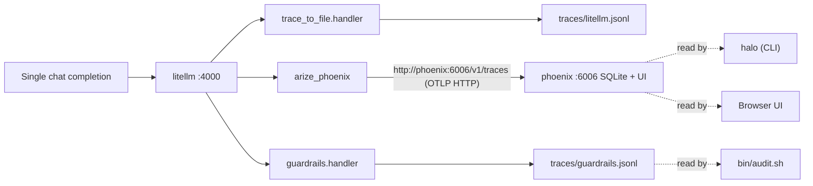

So:
- **What broke this morning?** → Phoenix UI.
- **Why did this prompt get blocked?** → grep `traces/guardrails.jsonl`.
- **What patterns are failing across 1000 runs?** → `halo` over the
  OTel traces in Phoenix (it reads OTel-format spans, not
  `traces/litellm.jsonl`).
- **Hot debugging right now?** → `tail -f traces/litellm.jsonl`.

---

## 11. Memory profiles — what runs in each mode

`stack profile <name>` flips a curated set of services on or off.
This diagram shows the four built-in profiles side by side.

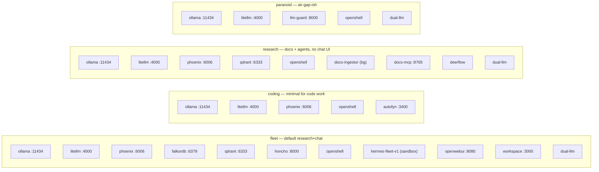

The profiles disagree only on the top tier. The inference plane
(LiteLLM + Ollama) is in every profile because nothing works without
it.

---

## 12. Network topology — host vs ai-stack vs OpenShell

Three distinct networks; the bridge points are where the interesting
traffic crosses.

```mermaid
flowchart TB
  subgraph Mac[macOS host - 127.0.10.x via /etc/hosts]
    direction TB
    Shell["Mac shell / browser"]
    OL[ollama :11434]
    DocsM[docs-mcp :8765]
    HonM["honcho-mcp :7082 (token-gated shim)"]
    FkM["falkordb-mcp :7083 (token-gated shim)"]
    DocsI["docs-ingestor (bg)"]
    Etc[/etc/hosts managed block/]
  end

  subgraph AS[ai-stack docker bridge 10.99.0.0/24]
    direction TB
    LL[litellm :4000]
    PX[phoenix :6006]
    QD[qdrant :6333]
    FK[falkordb :6379]
    OWU[openwebui :8080]
    LG[llm-guard :8000]
    HA[honcho :8000]
    HD["honcho-deriver (internal)"]
  end

  subgraph HONCHO[honcho_default - compose internal]
    direction TB
    HA2[honcho-api also here]
    HDB[honcho-database]
    HRE[honcho-redis]
    HD2[honcho-deriver also here]
  end

  subgraph SBX[OpenShell sandbox - own egress policy]
    direction TB
    HF["hermes-fleet-v1 (sandbox)"]
    GW[hermes-gw :8642]
  end

  Shell -- dial alias via /etc/hosts --> LL
  Shell -- dial alias via /etc/hosts --> PX
  Shell -- dial alias via /etc/hosts --> QD
  Etc -. resolves 127.0.10.x .-> LL

  LL -- "ollama:11434 via host-gateway" --> OL
  LL -- "http://phoenix:6006 via docker DNS" --> PX
  HA -- "litellm.ai-stack:4000 fully-qualified" --> LL

  HA --- HA2
  HD --- HD2

  HF -- inference.local --> GW
  GW -- "policy-allowed, host-gateway path" --> LL
  HF -. "honcho-mcp:7082 allowed (Bearer token)" .-> HonM
  HF -. "falkordb-mcp:7083 allowed (Bearer token)" .-> FkM
  HF -. "docs-mcp:8765 allowed (read-only, unauth)" .-> DocsM

  HonM -- "honcho:8000 (host-side only)" --> HA
  FkM -- "falkordb:6379 (host-side only)" --> FK

  %% NO sandbox edge to HA / FK: raw honcho:8000 + falkordb:6379 are DENIED to
  %% hermes-fleet-v1 and pi-v1 (retired in slice 3). The shim edges above are the
  %% ONLY memory paths out of a sandbox.

  DocsM -- "http://litellm:4000 via /etc/hosts" --> LL
  DocsM -- "http://qdrant:6333 via /etc/hosts" --> QD
```

Reading it:
- **Bridge point #1**: `/etc/hosts` block on the Mac — gives the Mac
  shell, browser, and host-side Python processes name-resolution into
  the `127.0.10.x` range. Phase 00·N owns this.
- **Bridge point #2**: the `ai-stack` Docker network — every managed
  container joins it; Docker's embedded DNS handles intra-network bare
  names.
- **Bridge point #3**: `--add-host=ollama:host-gateway` on each Ollama
  consumer — the single allowed container-to-host alias. Port `:11434`
  stays in the URL.
- **Multi-network containers** (honcho-api, honcho-deriver) sit on both
  `ai-stack` and `honcho_default`. Cross-network calls use
  fully-qualified `<service>.<network>` to avoid bare-name ambiguity.
- **Sandbox does not join `ai-stack`.** Its egress is policy-controlled
  (deny by default); it reaches `litellm` only via the `hermes-gw` L7
  proxy.
